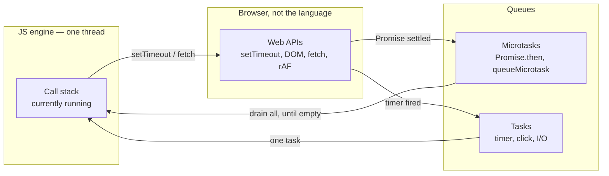
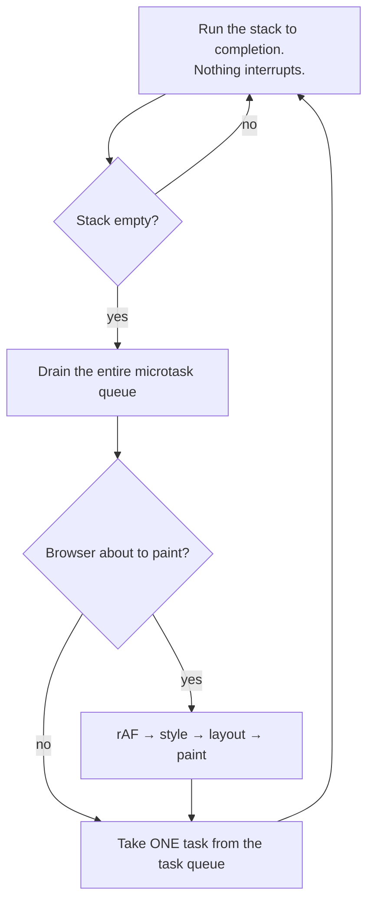
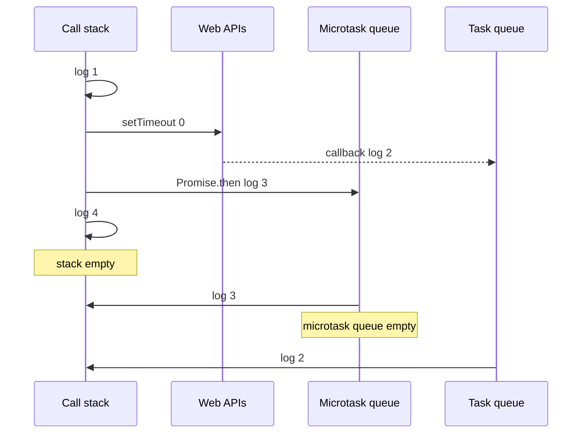
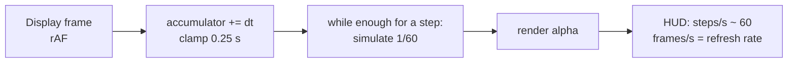

# Notes 01 — Event loop і ігровий цикл

Поруч із лабою: [lab-01-event-loop-and-game-loop.md](lab-01-event-loop-and-game-loop.md).

Лаба — **що здати** (корабель, чекліст, тег). Цей файл — **з чим розібратись**: коротка теорія і досліди. Підходить і на парі (шариш консоль), і вдома.

Досліди нижче — ті самі задачі, що на JS-співбесіді (черги, `this`, проміси, Node). Це не окремий «курс до інтерв’ю»: пояснив вивід уголос — ти вже відповідаєш.

Як проходити: Chrome → будь-яка сторінка → F12 → Console. Перед запуском скажи вголос, що очікуєш. Потім звіряй.

Лаба розбита на кроки **M1–M4** (milestone — етап здачі, не «модуль коду»):

| | Що зробити | Як перевірити очима |
|---|---|---|
| **M1** | ігровий цикл + три цифри на екрані | `steps/s` ≈ 60, `frames/s` ≈ герці монітора |
| **M2** | клавіатура + корабель | літає, виліт за край — поява з іншого боку |
| **M3** | гладке малювання, сітка/зірки | поворот без стрибка ніса |
| **M4** | три навмисні поломки | цифри в README, код знову робочий |

**HUD** (heads-up display) — напис поверх гри, як спідометр у автосимуляторі. У нас це три рядки зліва: `steps/s`, `frames/s`, `frame ms`. Не окреме вікно DevTools.

---

## Ідея

JavaScript у вкладці — **один потік**. Поки функція крутиться, ніщо інше в цій вкладці не виконається: ні клік, ні таймер, ні малювання кадру. «Пізніше» (`setTimeout`, Promise, `requestAnimationFrame`) браузер кладе в **черги**. Event loop забирає роботу, лише коли стек порожній.

У грі це видно одразу: симуляція рахується ~60 разів на секунду, а картинка малюється стільки разів, скільки герців у монітора. Тому на екрані (у HUD) два різні лічильники, не один.

Рушій не вміє «пізніше». Таймер, клік і rAF — це браузер. Він кладе колбек у чергу. Event loop забирає його, лише коли **стек порожній**.



Один оберт циклу (спрощено, як у доповіді Jake Archibald):



Ключ: мікрозадачі — **усі**, задача — **одна**. Тому ланцюжок `.then` може з’їсти кадр, а ланцюжок `setTimeout` — ні: між задачами браузер встигає намалювати.

---

## 1. Задача vs мікрозадача

Синхронний код біжить зараз. `Promise.then` / `queueMicrotask` — **мікрозадачі**: черга порожніє повністю перед наступною макрозадачею. `setTimeout` — **задача** (macrotask), навіть з `0`.

### Спробуй

```js
console.log('1')
setTimeout(() => console.log('2'), 0)
Promise.resolve().then(() => console.log('3'))
console.log('4')
```

**Очікуй:** `1`, `4`, `3`, `2`.

Шлях того самого коду чергами. Синхронне — одразу. `then` чекає порожнього стека, але **перед** таймером.



Ще раз, із прогнозом до запуску:

```js
console.log('1')
setTimeout(() => console.log('2'), 0)
Promise.resolve().then(() => console.log('3'))
queueMicrotask(() => console.log('5'))
console.log('4')
```

**Очікуй:** `1`, `4`, `3`, `5`, `2` — обидві мікрозадачі до таймера.

**Навіщо в грі:** важкий `.then` між кадрами відкладає paint так само, як важкий синхронний код. Кадр має бюджет ~16.7 мс на 60 Hz.

---

## 2. Стек ніхто не перериває

`setTimeout(fn, 0)` не означає «зараз». Означає «поклади `fn` у чергу; візьми, коли стек вільний».

### Спробуй

```js
setTimeout(() => console.log('timer'), 0)
const t = Date.now()
while (Date.now() - t < 2000) {}
console.log('done')
```

**Очікуй:** ~2 с зависання сторінки, потім `done`, потім `timer`. Під час `while` спробуй поскролити — не вийде.

**Чому:** call stack зайнятий. Event loop не дістанеться ні до таймера, ні до paint. З **цього ж** потоку синхронний блок не обійти (`await` усередині `while` не допоможе — цикл не асинхронний).

Це перший дослід етапу M4 з лаби, тільки в консолі. У грі той самий `while` під час малювання кадру дає ривок раз на секунду.

---

## 3. `requestAnimationFrame`, не `setInterval(16)`

rAF (`requestAnimationFrame`): «виклич мене перед наступним **paint**». Збігається з герцами екрана, на фоновій вкладці браузер майже зупиняє. `setInterval(fn, 16)` пливе, 16 ≠ 16.667, у фоні поводиться інакше.

### Спробуй

```js
let last = 0
let n = 0
function tick(now) {
  if (last) console.log((now - last).toFixed(2), 'ms')
  last = now
  n += 1
  if (n < 30) requestAnimationFrame(tick)
}
requestAnimationFrame(tick)
```

**Очікуй:** ~16.67 на 60 Hz, ~8.33 на 120 Hz. Згорни вкладку на кілька секунд, розгорни — наступний `dt` буде величезний.

**Навіщо в грі:** саме тому в циклі `accumulator += Math.min(dt, 0.25)` — інакше після паузи симуляція «надолужує» сотні кроків і зависає ще дужче (спіраль смерті).

---

## 4. Фіксований крок і `alpha`

Якщо рухати корабель на `velocity` **за кадр**, на 120 Hz він летить удвічі швидше. Якщо `velocity * dt` з реальним часом кадру — траєкторія залежить від fps (смерть для мультиплеєра в Lab 5).

Правило: симуляція завжди крок `1/60` с. Рендер малює «між» двома станами: `lerp(previous, current, alpha)`, де `alpha` від 0 до 1.



Кути: звичайний `lerp` між 359° і 1° дає 180° — ніс крутиться навпаки. Треба короткий шлях по колу (`lerpAngle` у лабі / у `render/draw.js`).

---

## 5. Замикання: `var` vs `let`

Функція тримає **змінні** зовнішнього скоупу, не копії значень. `var` — одна змінна на функцію. `let` у циклі — нова змінна на кожну ітерацію.

### Спробуй

```js
for (var i = 0; i < 3; i++) setTimeout(() => console.log('var', i))
for (let j = 0; j < 3; j++) setTimeout(() => console.log('let', j))
```

**Очікуй:** тричі `var 3`, потім `let 0`, `1`, `2`.

**Навіщо в грі:** `createInput` ховає `Set` клавіш у замиканні. `justPressed` треба «з’їсти» (`consume`), інакше «щойно натиснули» лишиться true. `e.repeat` ігноруй — ОС шле повторні keydown.

---

## 6. Модулі, одним дослідом

`<script type="module">`: свій скоуп, strict, `import`/`export`, `this` зверху — `undefined`. Без `import` сусідній файл не бачить твій `const`.

### Спробуй

У консолі на сторінці з модулем порівняй не вийде один-в-один. Зроби два файли або в `index.html`:

```html
<script>
  console.log('classic this', this)
</script>
<script type="module">
  console.log('module this', this)
</script>
```

**Очікуй:** classic — `window`; module — `undefined`.

---

## У проєкті `dogfight`

Коли етапи M1–M3 зроблені, ідеї з notes лежать у файлах так:

| Ідея | Де дивитись |
|---|---|
| rAF (`requestAnimationFrame`) + accumulator + clamp | `src/loop.js` |
| напис steps/s і frames/s (HUD) | `src/render/draw.js` → `drawHud` |
| input як замикання | `src/input.js` |
| фізика без DOM | `src/sim/ship.js` |
| wrap + не lerp крізь арену | `src/sim/arena.js` |
| `lerpAngle`, сітка, DPR (щільність пікселів екрана, щоб не було мила) | `src/render/draw.js`, `canvas.js` |

**M1 зроблено**, якщо не відкриваючи код: запусти гру, зачекай секунду. У лівому верхньому куті `steps/s` близько 60 (фізика), `frames/s` — як у твого екрана (60 / 120 / 144).

Етап M4 (три поломки: busy-wait, `setInterval`, змінний `dt`) роби **тимчасово**, цифри — в README, код знову чистий. Лаба так і просить.

---

## На співбесіді

Це не бонус до лаби — це ядро junior/middle JS. Типово просять на дошці або в консолі:

- Намалюй стек, Web APIs, task queue, microtask queue. Простеж `setTimeout(f, 0)` і `Promise.then(g)`.
- Чому `setTimeout(fn, 0)` не одразу? Коли надрукується `timer`, якщо перед ним `while` на 2 с?
- Чим мікрозадача відрізняється від задачі? Чому нескінченний ланцюжок `.then` може з’їсти кадри, а `setTimeout` — ні?
- Три причини, чому для анімації rAF, а не `setInterval(fn, 16)`.
- `var` vs `let` у циклі з `setTimeout` — що захоплює замикання: значення чи змінну?

Дослід §1 на папері без підглядання ≈ пройдене перше питання.

---

## Якщо мало часу

Три запуски: дослід §1, §2, §3. Потім відкрий гру і глянь три цифри зліва на canvas. Решту — з лаби, секція Theory.
