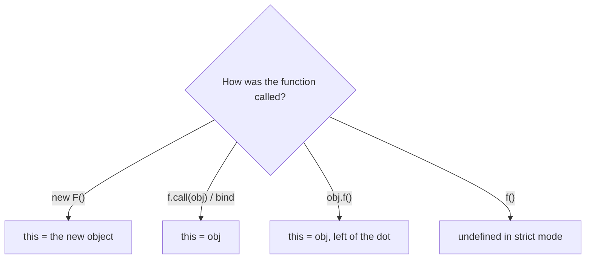
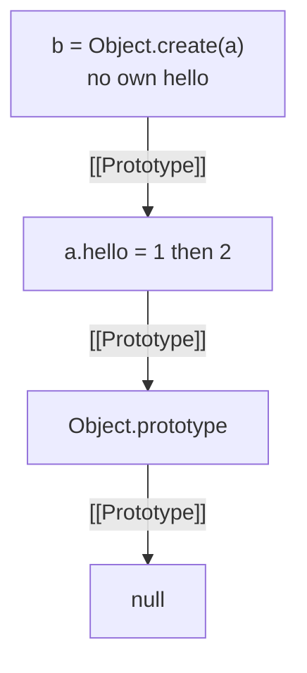
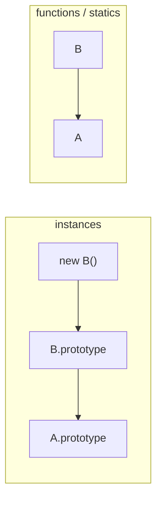

# Notes 02 — Об’єкти, `class`, `this`

Поруч із лабою: [lab-02-objects-prototypes-classes.md](lab-02-objects-prototypes-classes.md).

Лаба — **що здати** (сутності, чекліст, тег). Цей файл — **з чим розібратись**. Chrome → F12 → Console. Перед запуском — прогноз уголос.

**Що здати гру:** `class` + один `extends`, `this` у колбеках, композиція замість глибокої ієрархії, `Map` для світу.

**На парі (три досліди):** §1 делегація — один раз, щоб `class` на щось спирався; §2 `this`; §3 `Map`.

**Не брама для тега:** конструктори до 2015, два ланцюги `extends`, діаграма до `Function.prototype`, протокол ітераторів. Це «Якщо лишився час» і співбесіда.

Етапи здачі лаби (**M1–M4** — кроки, не файли):

| | Що зробити | Як зрозуміти, що готово |
|---|---|---|
| **M1** | вектор + базовий `Entity` | є об’єкт з позицією і `update` |
| **M2** | менеджер сутностей на `Map` | кулі й кораблі живуть у одній колекції |
| **M3** | колізії, шкода, респаун | постріл щось влучає |
| **M4** | композиція замість глибокої ієрархії | короткий запис у README, чому не `class PlayerShip extends …` |

**Менеджер сутностей** — звичайний об’єкт, який тримає всі «речі в світі» (кораблі, кулі) і раз за кадр каже їм оновитись. Не окремий рушій.

---

## Ідея

Багато сутностей ділять `update` і колізії. Пишеш `class` і щонайбільше один `extends` (`Ship extends Entity`). Методи не копіюються в кожну кулю — пошук іде вгору; цього досить.

`this` визначається **в момент виклику**, не «чиєю є функція». Глибша драбина `Entity → Moving → Ship → Player` ламається на homing-кулі — краще **композиція** (маленькі шматки поведінки в одному об’єкті).



---

## 1. Делегація, не копіювання

Один дослід на прототипи. Далі — `class`, не ручний ланцюг.

```js
const a = {}
const b = Object.create(a)
a.hello = 1
console.log(b.hello, b.hasOwnProperty('hello'))
console.log(Object.getPrototypeOf(b) === a)
a.hello = 2
console.log(b.hello)
```

**Очікуй:** `1`, `false`, `true`, потім `2`. У `b` немає власного `hello` — читає з `a`. Змінив прототип — «нащадки» бачать одразу. Тисяча куль так само ділять один `update`.



---

## 2. Чотири правила `this`

Порядок: `new` → `.call/.apply/.bind` → `obj.f()` (зліва від крапки) → голий `f()` дає `undefined` у strict (модулі й класи). Стрілка **не має** свого `this` — бере з лексичного скоупу.

```js
class A {
  m() {
    return this
  }
}
const a = new A()
const m = a.m
console.log('bare', m())
console.log('call', m.call(a))
```

**Очікуй:** `bare` — `undefined` (або помилка в strict); `call` — об’єкт `a`.

Типовий баг гри: `canvas.addEventListener('click', ship.fire)` — браузер викличе `fire` із `this` = елемент. Варіанти: `() => ship.fire()`, `ship.fire.bind(ship)`, або поле-стрілка в класі.

---

## 3. `Map` vs об’єкт як словник

```js
const o = { 1: 'x' }
const m = new Map([[1, 'x']])
console.log(o[1], o['1'])
console.log(m.get(1), m.get('1'))
const k = {}
o[k] = 1
console.log(Object.keys(o))
```

**Очікуй:** у об’єкта ключі стають рядками (`"1"`, `"[object Object]"`). У `Map` ключ `1` і `"1"` — різні; об’єкт як ключ не перетворюється на рядок.

Для id сутностей у грі — `Map`/`Set`, не `{}`.

---

## У проєкті

`class Entity` + `Ship extends Entity` (один рівень). Світ — `Map`. Кулі, колізії, `#hp`. Homing і pickup — композиція, не нова гілка `extends`. `this` у колбеках input/кнопок перевіряй одразу, не в Lab 5. Діаграма прототипів у README не потрібна.

---

## На співбесіді

Здати гру можна без цих формулювань. На дошці їх все одно люблять:

- Чотири правила `this`. Чому `const f = obj.method; f()` ламається і як полагодити (`bind`, стрілка, обгортка).
- Навіщо `Map`, якщо є `{}`.
- Чому не `Entity → Moving → HomingBullet`.
- Що відбувається при `obj.x`: власне поле vs прототип. `Object.create`, `getPrototypeOf`.
- `class` vs `function` + `prototype` — той самий ланцюг чи ні?

---

## Якщо лишився час

Два ланцюги в `extends` — інстанси окремо, статики окремо:

```js
class A {}
class B extends A {}
console.log(Object.getPrototypeOf(B.prototype) === A.prototype)
console.log(Object.getPrototypeOf(B) === A)
```

**Очікуй:** обидва `true`. Екземпляри: `b → B.prototype → A.prototype`. Самі класи (статики): `B → A`.



Генератор і «не блокуй цикл» (те саме, що `while` у Lab 1):

```js
function* fib() {
  let a = 0
  let b = 1
  for (;;) {
    yield a
    ;[a, b] = [b, a + b]
  }
}
const g = fib()
const first = []
for (const n of g) {
  first.push(n)
  if (first.length === 10) break
}
console.log(first)
```

**Очікуй:** перші 10 чисел Фібоначчі. `[...fib()]` **не** роби — нескінченний генератор зависне.

---

## Якщо мало часу

Три запуски: §2 (`this`), §3 (`Map`), §1 (делегація). Потім пиши `class` і світ на `Map`. Решту — з лаби, секції Theory 2–4.
