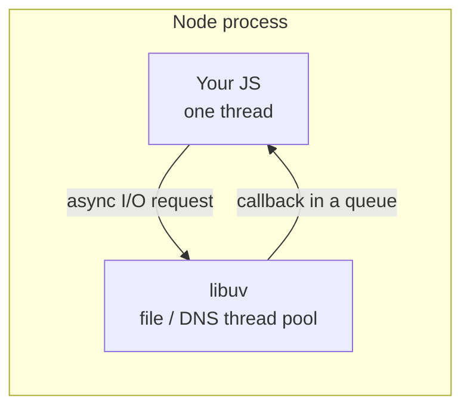
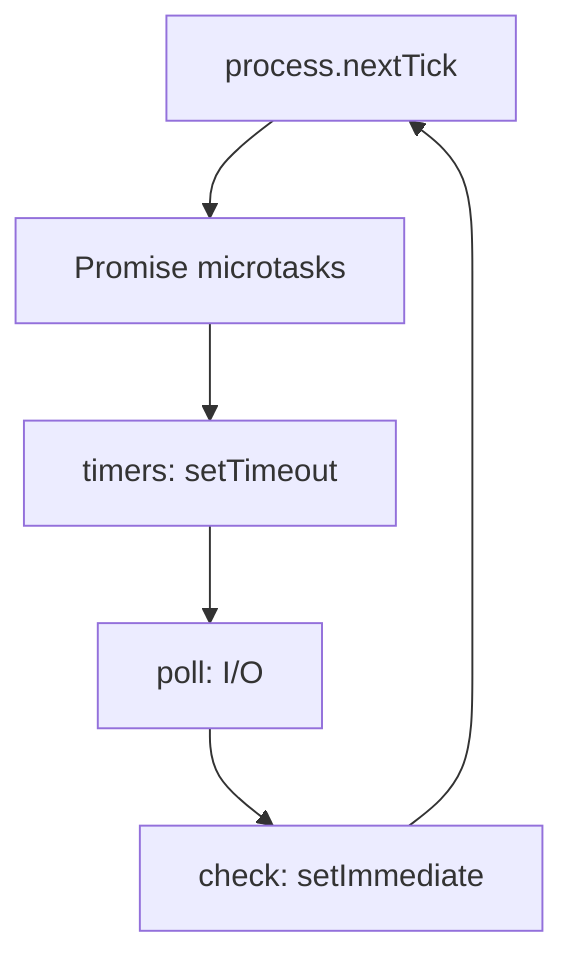
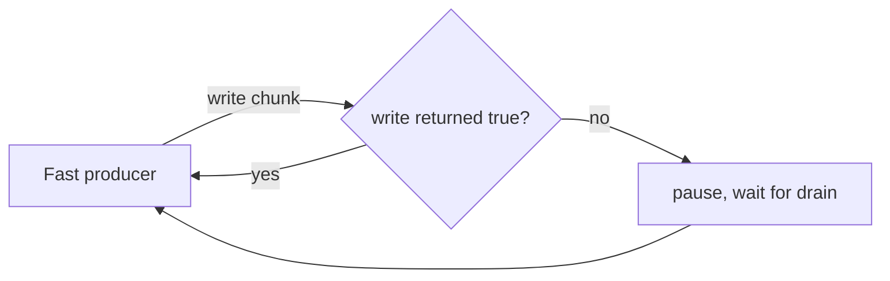

# Notes 04 — Node: EventEmitter, streams, WebSocket

Поруч із лабою: [lab-04-node-streams-websockets.md](lab-04-node-streams-websockets.md).

Тут уже **термінал + Node**, не консоль вкладки. Той самий JS, інше **середовище** (host): немає DOM, є файли, сокети, `process`. Для backend-вакансій це окремий блок питань.

Етапи здачі (**M1–M4**):

| | Що зробити | Як перевірити |
|---|---|---|
| **M1** | HTTP-сервер віддає гру + просте API | у браузері відкривається клієнт з `localhost` |
| **M2** | кімнати й життєвий цикл WebSocket | два вікна бачать join/leave/чат |
| **M3** | лог матчу стрімом на диск | файл росте під час гри, RAM не пухне |
| **M4** | ліміти зловживань + запис про event loop | README: що буде, якщо заблокувати потік |

---

## Ідея

Твій код усе ще **однопотоковий**. **libuv** — шар Node для диску й мережі (I/O: input/output); файли він може читати в інших потоках, але твій JS — один. Важкий цикл у обробнику запиту стопорить усіх клієнтів (урок Lab 1, вищі ставки).

Два стовпи Node: **`EventEmitter`** (усе щось емітить) і **streams** (backpressure: швидкий продюсер не повинен залити пам’ять, коли споживач повільний).



Спрощені фази (між ними ще nextTick + мікрозадачі):



---

## 1. Фази циклу: що стабільне

```bash
node -e "setTimeout(()=>console.log('t'),0); setImmediate(()=>console.log('i')); process.nextTick(()=>console.log('n')); Promise.resolve().then(()=>console.log('p'))"
```

Запусти 5 разів.

**Очікуй:** `n` потім `p` майже завжди (nextTick раніше за мікрозадачі). `t` vs `i` з головного модуля **може плавати**. Всередині I/O-колбека порядок `setImmediate` / `setTimeout(0)` уже передбачуваніший — це в гайді Node про event loop.

---

## 2. `'error'` без слухача валить процес

```bash
node -e "const { EventEmitter } = require('node:events'); new EventEmitter().emit('error', new Error('boom'))"
```

**Очікуй:** процес упав. Додай `.on('error', …)` і повтори — живий. WebSocket і `fs` так само: забутий `error` = падіння сервера вночі.

---

## 3. Байти ≠ символи

```bash
node -e "console.log(Buffer.from('привіт').length, 'привіт'.length); console.log(Buffer.from([0xff, 0x00]).readUInt16BE(0))"
```

**Очікуй:** буфер довший за `.length` рядка (UTF-8). `readUInt16BE` → `65280`. У Lab 5 це вже бінарний протокол.

---

## 4. Backpressure (обережно)

Ідея: `writable.write(chunk)` повертає `false` → треба чекати `'drain'`. Ігноруєш — **RSS** (скільки RAM з’їв процес) росте, поки не вб’є машину.



Мінімально безпечна перевірка: читай у доках `stream.pipeline` і порівняй із циклом `for` + `write` без перевірки повернення. Другий варіант **не лишай крутитись**. У лабі є повний дослід — роби його з лімітом ітерацій або будь готовий `Ctrl+C`.

---

## 5. Echo WebSocket у одному скрипті

Каркас (залежність `ws` як у лабі): підняти `WebSocketServer`, клієнт `new WebSocket`, на `message` — echo. Потім `maxPayload: 1024` і надішли 2 KB — на сервері подія помилки / закриття.

Це вже кістяк ігрового сервера Lab 4: кімнати + чат. Стан світу по дроту — Lab 5.

---

## У проєкті

Сервер роздає клієнт, тримає кімнати, стрімить лог матчу на диск **стрімом**, не `readFile` цілого файлу в RAM.

---

## На співбесіді

- Чим Node відрізняється від браузера (globals, I/O, один потік JS).
- Що таке backpressure. Чому `write` повертає `false`.
- `EventEmitter` без слухача `'error'` — що з процесом?
- ESM (`import`/`export`) vs CommonJS (`require`) — коли що, і чому `"type": "module"`.
