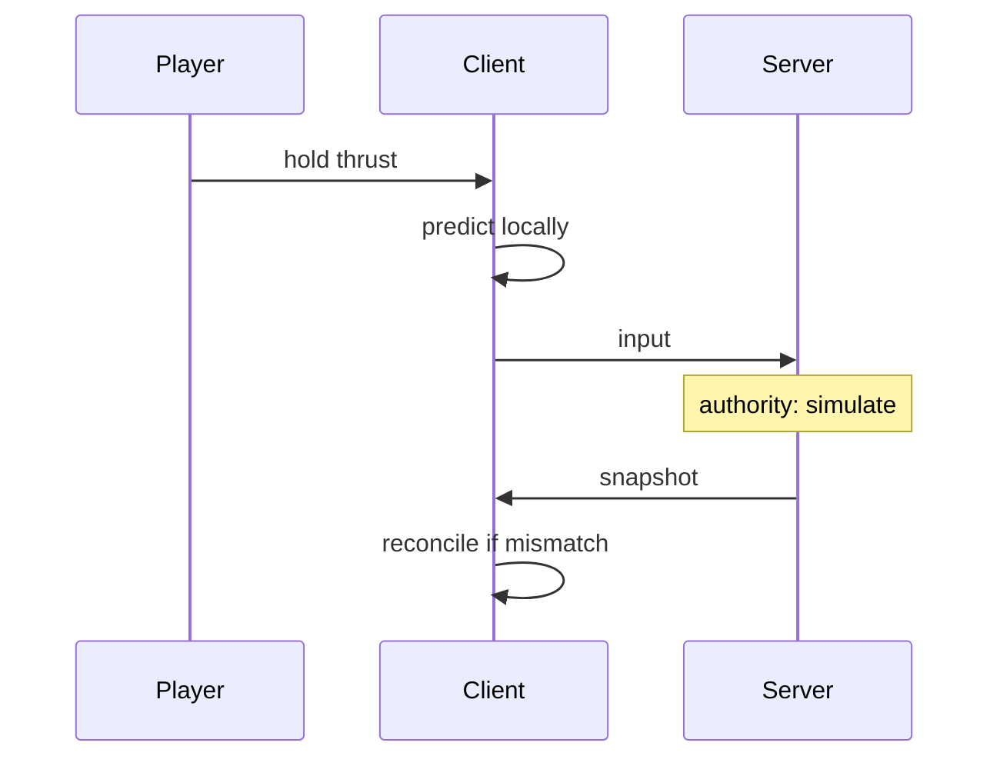
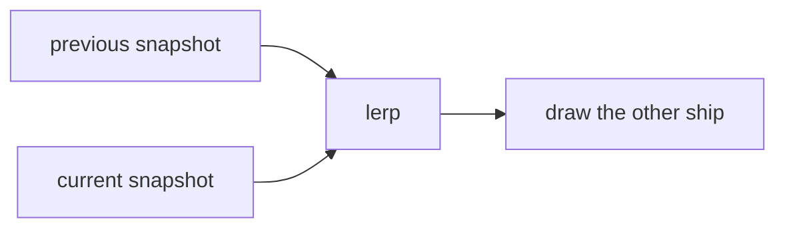
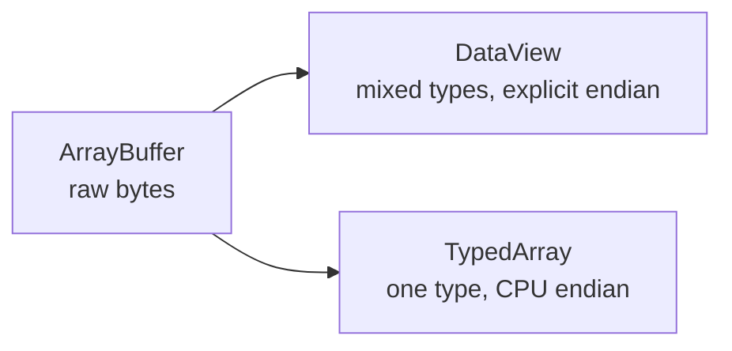

# Notes 05 — Мережа в реальному часі

Поруч із лабою: [lab-05-realtime-networking.md](lab-05-realtime-networking.md).

Консоль або `node`. Без штучної затримки на localhost «все літає» — це брехня. На співбесіді про ігри / realtime питають prediction одним абзацом; про фронт — «навіщо ArrayBuffer».

Етапи здачі (**M1–M4**):

| | Що зробити | Як перевірити |
|---|---|---|
| **M1** | спільна симуляція, сервер крутить час, клієнт «дурний» | два вікна, але керування з затримкою мережі |
| **M2** | передбачення на клієнті + звірка з сервером | газ реагує одразу, інколи легкий «відскік» позиції |
| **M3** | інтерполяція чужого корабля | другий гравець не телепортується |
| **M4** | бінарний протокол і заміри байт/с | у README: JSON vs `DataView`, цифри |

**RTT** — round-trip time: скільки мілісекунд туди-назад до сервера (пінг). **Netgraph** — маленький графік поверх гри (пінг, трафік), як лічильники з Lab 1, тільки про мережу. **Prediction** — клієнт рухає твій корабель одразу, не чекаючи відповіді. **Reconciliation** — прийшов знімок «насправді ти був тут», клієнт підкручує.

---

## Ідея

Сервер — **джерело правди**. Клієнт малює передбачення, щоб керування не чекало RTT (пінг), і **звіряється**, коли приходить знімок. Інтерполяція чужих кораблів — між двома минулими знімками, не «малюй останнє».

Симуляція з Lab 1 (фіксований крок, чистий `integrate`) тут обов’язкова: інакше два клієнти роз’їдуться.



Чужого гравця не «малюй останнє»: між двома вже отриманими знімками.



---

## 1. Endianness (порядок байтів у числі)

```js
const b = new ArrayBuffer(8)
const v = new DataView(b)
v.setFloat32(0, 1.5, true)
console.log('LE', [...new Uint8Array(b)])
v.setFloat32(0, 1.5, false)
console.log('BE', [...new Uint8Array(b)])
```

**Очікуй:** байти в протилежному порядку. `true` = little-endian (молодший байт перший, як у x86). У протоколі завжди фіксуй little-endian і пиши це в коментарі-спеці.

---

## 2. Typed array сидить на CPU-endian

```js
console.log(new Uint16Array(new Uint8Array([1, 0, 0, 1]).buffer))
```

**Очікуй:** на little-endian машині щось на кшталт `256, 256` (залежить від вирівнювання). Для змішаного бінарного формату — `DataView`, не `Uint16Array` поверх чужого буфера.

---

## 3. JSON vs бінарний знімок

```js
const ships = Array.from({ length: 8 }, (_, i) => ({
  id: i,
  x: 100.5,
  y: 200.25,
  angle: 1.23,
}))
const json = JSON.stringify(ships)
console.log('json bytes', new TextEncoder().encode(json).byteLength)

const buf = new ArrayBuffer(8 * 16)
const d = new DataView(buf)
ships.forEach((s, i) => {
  const o = i * 16
  d.setUint16(o, s.id, true)
  d.setFloat32(o + 2, s.x, true)
  d.setFloat32(o + 6, s.y, true)
  d.setFloat32(o + 10, s.angle, true)
})
console.log('binary bytes', buf.byteLength)
```

**Очікуй:** JSON у рази більший. На 30 Hz це вже трафік. Лаба просить порівняти свої реальні знімки.



---

## 4. Jitter таймера

```js
const times = []
const id = setInterval(() => {
  times.push(performance.now())
  if (times.length >= 30) {
    clearInterval(id)
    const dt = times.slice(1).map((t, i) => t - times[i])
    console.log({
      min: Math.min(...dt).toFixed(2),
      max: Math.max(...dt).toFixed(2),
    })
  }
}, 33)
```

**Очікуй:** інтервали не рівні 33. Для ігрового сервера краще «ціль = старт + n × step», а не ланцюжок `setInterval`.

---

## 5. Детермінізм

Прокрути свій `integrate` 1000 кроків з однаковим input у Chrome і в Node, порівняй стан. Додай `Math.random()` — хеші роз’їдуться. Сервер і клієнт мають крутити **ту саму** чисту функцію.

---

## У проєкті

Спочатку netgraph (графік пінгу й байт/с) і слайдер затримки. Потім prediction + reconciliation. Два вікна браузера — обов’язкова перевірка, не опція.

---

## На співбесіді

- Чому сервер authoritative, а не «кожен клієнт шле позицію».
- Client-side prediction і reconciliation — двома реченнями, без слайдів.
- `ArrayBuffer` / `DataView` / endianness. Чому JSON знімки дорогі.
- Навіщо детермінована симуляція (Lab 1) для мережі.
