# Programming Fundamentals — Build a Computer You Can See

[English](README.md) · [Українською](README.uk.md)

> "The computer is a machine that moves bits. Types, names, and languages are stories we tell about those bits so we can think."

A 16-week, 8-lab course for **first-year** students. You do not need to have programmed before. Across the semester you build **one machine**: a tiny virtual computer. By Lab 8 you write programs *for* it in a language *you* scanned and assembled. A recruiter can clone the repo, run one command, and see the dump, the pixels, and a Fibonacci that lives on a stack you implemented.

The working name of that machine is **`ember`**. It is not a library and not a programming language — it is the program *you* write, named so every lab can point at the same thing. Call your copy whatever you like. Theme it: a flight computer, a game console, a spacecraft bus, a pocket calculator that got out of hand.

---

## How we think about the course

Each lab has two halves that need each other:

1. **One idea about how programs actually work** — the mental model, what the machine is doing, the classic pitfalls, and a few experiments you run in the terminal until the idea is boring.
2. **One increment of `ember`** that *cannot be built without that idea*. You meet integers when a byte wraps from 255 to 0. You meet bits when an instruction is a byte you have to decode. You meet pointers when the CPU has to *find* a value instead of holding it. You meet arrays when a screen is a grid of pixels. You meet a lexer when typing hex by hand becomes unbearable and you want to write `ADD A, B`.

A virtual computer is the vehicle because nothing important stays a metaphor. Overflow shows up in a dump. Walking off an array is a sanitizer report you caused on purpose. Recursion is a stack that grows until it doesn't. Source code becoming instructions is a scanner you wrote.

Work happens in the **terminal**: you compile with `c++` / `cmake`, you talk to `ember` by typing commands, you paste the output into your README. That output *is* the test.

---

## What we drew on

This course sits in the same family as the [Python](../python/README.md) and [JavaScript](../javascript/README.md) courses in this repository: **one project, eight two-week labs**, theory that exists because the next feature needs it, notes you can run on a pair of screens, a five-minute defense instead of a paper exam.

The wider 42-lab program — and behind it [École 42](https://42.fr/) — is the posture: you learn by shipping something you can demo, not by collecting completed worksheets.

For the *machine* itself we borrowed freely:

- **[Ben Eater's 8-bit breadboard computer](https://eater.net/8bit)** — registers and an ALU you can point at on a desk. When Lab 2 feels abstract, watch an episode.
- **[NAND2Tetris](https://www.nand2tetris.org/)** (Nisan & Schocken) — a computer from simple parts all the way to a program. These eight labs are a compressed, C++-flavored cousin of the middle of that journey.
- **CHIP-8** — a 64×32 display made of bits; Lab 5's screen is in that family.
- **[Crafting Interpreters](https://craftinginterpreters.com/)** (Bob Nystrom) — Lab 8's attitude: a language begins as a scanner that turns text into tokens, then into bytes the CPU already understood.

C++ is the glass: a small subset (types, functions, structs, pointers) so you can *see* the bytes. It is not a tour of the whole language.

---

## The project: `ember`

`ember` is a C++ program that *pretends to be a small computer*:

- 4096 bytes of RAM you can print (`dump`)
- a few registers (named slots the CPU uses right now)
- an instruction set you grow opcode by opcode
- from Lab 5, a 64×32 pixel display drawn with characters in the terminal
- from Lab 8, an assembler: you type `ADD A, B` instead of poking hex

You run it like any other command-line program: `./build/ember`. It prints a prompt. You type `dump`, `get 0`, `step`. Later: `./build/ember programs/fib.asm`.

```mermaid
flowchart LR
    L1[Lab 1<br/>Types & compilation<br/><i>a box of bytes, a dump</i>] --> L2[Lab 2<br/>Bits & number systems<br/><i>flags, ALU, opcodes</i>]
    L2 --> L3[Lab 3<br/>Pointers & addresses<br/><i>load, store, peek</i>]
    L3 --> L4[Lab 4<br/>Control flow & scope<br/><i>jumps, loops, search</i>]
    L4 --> L5[Lab 5<br/>Arrays & strings<br/><i>display, sort, text</i>]
    L5 --> L6[Lab 6<br/>Structs, enums, heap<br/><i>CPU as data, sprites</i>]
    L6 --> L7[Lab 7<br/>Functions & the stack<br/><i>CALL/RET, recursion</i>]
    L7 --> L8[Lab 8<br/>A language<br/><i>lexer, assembler, programs</i>]
```



Everyone builds the same *kind* of machine. Your voice is the theme, extra opcodes, the programs you write for it, and the README that tells the story.

---

## Words the labs use

Read this once. The labs assume these meanings.

| Word | What it means here |
|---|---|
| **`ember`** | The name of *your* project — the virtual computer you are writing in C++. Rename it if you want. |
| **Virtual machine (VM)** | A program that behaves like a CPU + memory. `ember` is a VM. |
| **Byte** | 8 bits. One cell of `ember` RAM. |
| **Dump** | Print memory as hex (and ASCII), like the Unix tool `hexdump`. Command: `dump`. |
| **Peek / poke** (`get` / `set`) | Read a byte at an address; write a byte at an address. |
| **CLI / prompt** | You run a program in the terminal and type commands at it. No window, no Run button. |
| **Register** | A named slot inside the CPU (`A`, `B`, `PC`) that holds a value *now*. |
| **`PC` (program counter)** | The address of the *next* instruction to run. |
| **Opcode** | The byte (or field of a byte) that means “which instruction this is” (`ADD`, `HALT`, …). |
| **ALU** | Arithmetic-logic unit: the part that adds, ANDs, shifts — in our case, C++ functions you write. |
| **Guest vs host** | *Guest* = numbers inside `ember` (address `0…4095`). *Host* = your real C++ process (`Byte*` into the array). Don't mix them. |
| **Assembler** | A program that turns text (`ADD A, B`) into the bytes `step` already runs. |
| **Lexer / scanner** | The first stage of that: walk characters, emit tokens, or report an error with a line number. |
| **Sanitizer** | Extra checks compiled *into* the binary. When you walk off an array, the program aborts and prints a report instead of “maybe printing 42.” |
| **ASan** | **AddressSanitizer** (`-fsanitize=address`). Catches out-of-bounds, use-after-free, double-free. |
| **UBSan** | **UndefinedBehaviorSanitizer** (`-fsanitize=undefined`). Catches things like signed integer overflow. |
| **UB** | Undefined behaviour: the language does not promise what happens. Sanitizers make some of it visible. |
| **CMake** | The build tool: you describe the project once, then `cmake --build` compiles it the same way on every OS. |

---

## The eight labs

| # | Lab | Notes | What you understand | What you add to `ember` |
|---|---|---|---|---|
| 1 | [A Box of Bytes](lab-01-a-box-of-bytes.md) | [notes](lab-01-a-box-of-bytes.notes.md) | Compilation, types as sizes, overflow, `const`, characters as numbers | A CMake project, 4 KB of memory, a hex dump, poke/peek |
| 2 | [Bits Don't Lie](lab-02-bits-dont-lie.md) | [notes](lab-02-bits-dont-lie.notes.md) | Binary/hex, two's complement, flags, bitwise ops, masks | An ALU, a flags register, opcode decode, `step` |
| 3 | [Addresses, Not Names](lab-03-addresses-not-names.md) | [notes](lab-03-addresses-not-names.notes.md) | Pointers, `&`/`*`, `void*`, `sizeof`, pointer arithmetic | `LOAD`/`STORE`, a program counter that walks memory |
| 4 | [The Shape of Control](lab-04-the-shape-of-control.md) | [notes](lab-04-the-shape-of-control.notes.md) | Booleans, `if`/`switch`/`while`/`for`, short-circuit, block scope | `JMP`/`JZ`, a loop in bytecode, linear search |
| 5 | [Many of One Thing](lab-05-many-of-one-thing.md) | [notes](lab-05-many-of-one-thing.notes.md) | Arrays, 2D indexing, strings, search, simple sorts | A 64×32 display, `PLOT`, sort a region, print a string |
| 6 | [Named Bundles](lab-06-named-bundles.md) | [notes](lab-06-named-bundles.notes.md) | `struct`, `enum`, lifetime, stack vs heap, leaks | `CPU`/`Instruction` as structs, a heap region, sprites |
| 7 | [Call and Return](lab-07-call-and-return.md) | [notes](lab-07-call-and-return.notes.md) | Functions, value vs pointer, the call stack, recursion, headers | `Stack` ADT, `CALL`/`RET`, recursive Fibonacci in bytecode |
| 8 | [Give It a Language](lab-08-give-it-a-language.md) | [notes](lab-08-give-it-a-language.notes.md) | Tokens, scanners, linked lists, ADTs, syntax errors | A lexer + assembler; `hello`, `search`, `fib`, `bounce` as `.asm` |

Each lab is **two weeks**. Week 16 is the showcase.

| Weeks | Lab | Weeks | Lab |
|---|---|---|---|
| 1–2 | Lab 1 | 9–10 | Lab 5 |
| 3–4 | Lab 2 | 11–12 | Lab 6 |
| 5–6 | Lab 3 | 13–14 | Lab 7 |
| 7–8 | Lab 4 | 15–16 | Lab 8 + showcase |

Labs are in English; the `.notes.md` files are in Ukrainian (pair work, paste-and-run). This README has a [Ukrainian twin](README.uk.md).

---

## What each lab looks like

Same shape as the Python and JavaScript courses:

1. **This lab's feature** — what you'll master and why it matters beyond this project.
2. **Notes** — a short companion: theory, paste-ready snippets, expected output. Use it in class or alone; it does not replace the lab.
3. **Theory** — the mental model, what's under the hood, pitfalls, *prove-it-to-yourself* experiments. This is the reading.
4. **Project step** — what to add to `ember`, with milestones and a definition of done.
5. **Deliverable checklist**
6. **Reflection** — explain it at the whiteboard.
7. **Stretch** — optional, when you're ahead.
8. **Resources** — a few talks and chapters, each with one line on *why this one*.

---

## Rules of the course

- **Solo.** You'll hold the whole machine in your head by the end, which is the point.
- **One repository, from day one.** Public GitHub. Commit as you go. Tag each lab (`lab-01`, `lab-02`, …).
- **README is part of every deliverable.** Each lab adds a section: what you built, pasted terminal output, what surprised you. By Lab 8 that README is the story of a computer.
- **Terminal only.** Compile, run, and check from a shell. Notes snippets → `c++ … scratch.cpp`. `ember` → a prompt you type into. Evidence is **pasted stdout** (and sanitizer reports).
- **Every lab ends in a 5-minute defense.** Demo the increment; answer 2–3 Reflection questions. If you can't explain a line, it doesn't count.
- **AI assistants** — follow the [program-wide policy](../../README.md). Use them to learn faster, not to skip understanding.
- **Sanitizers stay on.** A program that is undefined behaviour is not “working,” even if it printed something.

---

## Tooling standard

- **C++17** (or newer). Subset: types, functions, structs, pointers. No class hierarchies. You may *compare* with `std::vector` / `std::string` after you've built the thing yourself.
- **CMake**

  ```bash
  cmake -S . -B build -DCMAKE_BUILD_TYPE=Debug
  cmake --build build
  ./build/ember
  ```

- **clang or gcc** in the terminal (`c++`, `clang++`, or `g++`):  
  `-std=c++17 -Wall -Wextra -Werror -fsanitize=address,undefined`  
  On Windows, use WSL (or another Unix-like shell) so ASan/UBSan work.
- **Notes experiments**

  ```bash
  c++ -std=c++17 -Wall -Wextra -Werror -fsanitize=address,undefined scratch.cpp -o scratch && ./scratch
  ```

  The same line sits at the top of [Notes 01](lab-01-a-box-of-bytes.notes.md).
- **clang-format** — pick a style in Lab 1 and stop thinking about it.
- **A debugger is optional.** If you use one, it is `lldb` or `gdb` in that same terminal. Printing a byte with `get` / `std::cout` is the required proof.
- **[Compiler Explorer](https://godbolt.org/)** — optional Stretch. The required path never leaves your shell.

---

## The resource shelf

Everything essential is free.

- **[Ben Eater — Building an 8-bit breadboard computer](https://eater.net/8bit)** — the hardware twin of Labs 2–3.
- **[NAND2Tetris](https://www.nand2tetris.org/)** — from parts to a program.
- **[learncpp.com](https://www.learncpp.com/)** — the best free C++ textbook for a first pass. Reference, not syllabus.
- **[cppreference.com](https://en.cppreference.com/)** — the language. Grep it; don't read it cover to cover.
- **K&R, *The C Programming Language*** — short, dense. Chapters 1–5 overlap Labs 1–5.
- **[Crafting Interpreters](https://craftinginterpreters.com/)** — scanning and tokens (Lab 8). You are not building Lox; you are stealing the attitude.
- **[CS:APP](https://csapp.cs.cmu.edu/)** — bits, memory, and machine code when you want more depth on Labs 2–3.
- **Crash Course Computer Science** — binary, registers, machine code in about ten minutes.

---

## What you'll be able to say at the end

- *"I built a virtual computer with 4 KB of memory. Here's a dump; here's the program counter; here's a pixel I plotted."*
- *"Instructions are bytes. I decode them with masks and implement ADD as bits — and I also used C++ `+` so I could check myself."*
- *"Functions are not magic: `CALL` pushes a return address, `RET` pops it. I can show you Fibonacci overflowing the stack."*
- *"I wrote a lexer that turns `ADD A, B` into tokens and an assembler that turns tokens into the bytes the CPU already understood."*
- *"I can explain two's complement, why `0.1 + 0.2` is not `0.3`, what a pointer is, and what AddressSanitizer printed when I walked off the array."*

Start with [Lab 1](lab-01-a-box-of-bytes.md).
