```mermaid
flowchart LR
    L1[Lab 1<br/>Types & compilation<br/><i>a box of bytes, a dump</i>] --> L2[Lab 2<br/>Bits & number systems<br/><i>flags, ALU, opcodes</i>]
    L2 --> L3[Lab 3<br/>Pointers & addresses<br/><i>load, store, peek</i>]
    L3 --> L4[Lab 4<br/>Control flow & scope<br/><i>jumps, loops, search</i>]
    L4 --> L5[Lab 5<br/>Arrays & strings<br/><i>display, sort, text</i>]
    L5 --> L6[Lab 6<br/>Structs, enums, heap<br/><i>CPU as data, sprites</i>]
    L6 --> L7[Lab 7<br/>Functions & the stack<br/><i>CALL/RET, recursion</i>]
    L7 --> L8[Lab 8<br/>A language<br/><i>lexer, assembler, programs</i>]
```

# Programming Fundamentals — Build a Computer You Can See

> "The computer is a machine that moves bits. Types, names, and languages are stories we tell about those bits so we can think."

This is a 16-week, 8-lab course for **first-year** students. You do not need to have programmed before. You will not spend the semester filling variant tables, drawing flowcharts nobody will execute, or writing a scanner that recognizes `$A1:$FF` for a report. You will build **one machine across all eight labs**: a tiny virtual computer — memory you can dump, an instruction set you implement, a screen made of bytes, a stack that makes functions real — and by Lab 8 you will write programs *for* it in a language *you* lexed and assembled.

Every lab has two halves that reinforce each other:

1. **One idea about how programs actually work.** Not a syntax drill — the mental model: what a type is (a size and a set of operations), what an address is, why a loop is a jump, why a function needs a stack, why a compiler starts as a scanner. The classic pitfalls. The questions that show you understood.
2. **One increment of the machine** that *needs* that idea. You meet integers when a byte wraps from 255 to 0. You meet bits when an opcode is a byte you have to decode. You meet pointers when the CPU has to *find* a value instead of holding it. You meet arrays when a screen is a grid of pixels. You meet a lexer when hex bytecode becomes untypable and you want to write `ADD A, B`.

A virtual computer is the right vehicle for a first course because nothing is a metaphor. Overflow is on the dump. A dangling pointer is an AddressSanitizer report you caused on purpose. Recursion is a stack that grows until it doesn't. The "scanner" from a typical coursework assignment stops being a puzzle about `$` and `:` and becomes the front door of a language you will run.

By Lab 8 you'll have a portfolio project a recruiter can clone and run in one command — and you'll be able to explain bytes, two's complement, pointers, the call stack, and how source becomes instructions at a whiteboard. That *is* programming fundamentals. The rest is paperwork.

The working name in these labs is **`ember`**. Name yours whatever you like. Theme it: a flight computer, a game console, a spacecraft bus, a pocket calculator that got out of hand.

---

## The project: a pocket computer

`ember` is 4 KB of memory, a handful of registers, a stack, an instruction set you grow opcode by opcode, and (from Lab 5) a 64×32 pixel display drawn in the terminal. You poke bytes. You step. You watch. From Lab 8 you type assembly instead of hex.

There are no variants. Everyone builds the same kind of machine. Your *voice* is the theme, the extra opcodes, the programs you write for it, and the README that tells the story.

---

## The eight labs

| # | Lab | Notes | What you understand | What you add to `ember` |
|---|---|---|---|---|
| 1 | [A Box of Bytes](lab-01-a-box-of-bytes.md) | [notes](lab-01-a-box-of-bytes.notes.md) | Compilation, types as sizes, overflow, `const`, characters as numbers | A CMake project, 4 KB of memory, a hex dump, poke/peek |
| 2 | [Bits Don't Lie](lab-02-bits-dont-lie.md) | [notes](lab-02-bits-dont-lie.notes.md) | Binary/hex, two's complement, flags, bitwise ops, masks | An ALU, a flags register, opcode decode, `step` |
| 3 | [Addresses, Not Names](lab-03-addresses-not-names.md) | [notes](lab-03-addresses-not-names.notes.md) | Pointers, `&`/`*`, `void*`, `sizeof`, pointer arithmetic | `LOAD`/`STORE`, a program counter that walks memory |
| 4 | [The Shape of Control](lab-04-the-shape-of-control.md) | [notes](lab-04-the-shape-of-control.notes.md) | Booleans, `if`/`switch`/`while`/`for`, short-circuit, block scope | `JMP`/`JZ`, a loop in bytecode, linear search |
| 5 | [Many of One Thing](lab-05-many-of-one-thing.md) | [notes](lab-05-many-of-one-thing.notes.md) | Arrays, 2D indexing, strings, search, simple sorts | A 64×32 display, `PLOT`, sort a region, print a string |
| 6 | [Named Bundles](lab-06-named-bundles.md) | [notes](lab-06-named-bundles.notes.md) | `struct`, `enum`, lifetime, stack vs heap, leaks | `CPU`/`Instruction` as structs, a heap region, sprites |
| 7 | [Call and Return](lab-07-call-and-return.md) | [notes](lab-07-call-and-return.notes.md) | Functions, value vs pointer, the call stack, recursion, headers | `Stack` ADT, `CALL`/`RET`, recursive Fibonacci in bytecode |
| 8 | [Give It a Language](lab-08-give-it-a-language.md) | [notes](lab-08-give-it-a-language.notes.md) | Tokens, scanners, linked lists, ADTs, syntax errors | A lexer + assembler; `hello`, `search`, `fib`, `bounce` as `.asm` |

Each lab is **two weeks**. The schedule assumes a 16-week semester; week 16 is the showcase.

| Weeks | Lab | Weeks | Lab |
|---|---|---|---|
| 1–2 | Lab 1 | 9–10 | Lab 5 |
| 3–4 | Lab 2 | 11–12 | Lab 6 |
| 5–6 | Lab 3 | 13–14 | Lab 7 |
| 7–8 | Lab 4 | 15–16 | Lab 8 + showcase |

---

## What each lab looks like

Every lab file has the same shape as the [Python](../python/README.md) and [JavaScript](../javascript/README.md) courses:

1. **This lab's feature** — what you'll master and why it matters beyond this project.
2. **Notes** — a short companion (`.notes.md`): a bit of theory, paste-ready snippets, expected output. Use it in class or alone; it does not replace the lab.
3. **Theory** — a compact explanation: the mental model, what's under the hood, the pitfalls, and *prove-it-to-yourself* experiments. This is the reading; it replaces a lecture.
4. **Project step** — what to add to `ember`, with milestones and a definition of done.
5. **Deliverable checklist** — what "done" means for this lab.
6. **Reflection** — explain it at the whiteboard.
7. **Stretch** — one optional deeper cut for when you're ahead.
8. **Resources** — a few talks, chapters, and tools, each with one line on *why this one*.

---

## Rules of the course

- **Solo.** Individual work. You'll hold the whole machine in your head by the end, which is the point.
- **One repository, from day one.** Public GitHub repo. Commit as you go. At the end of each lab, **tag it** (`lab-01`, `lab-02`, …) so the history shows the computer growing.
- **README is part of every deliverable.** Each lab adds a section: what you built, the dump or screenshot the lab asked for, what surprised you. By Lab 8 that README is the story of a computer.
- **Every lab ends in a 5-minute defense.** You demo the increment and answer 2–3 Reflection questions. You should be able to explain every line you committed.
- **AI assistants** — follow the [program-wide policy](../../README.md). Use them to learn faster, not to skip understanding. If you can't explain it at the defense, it doesn't count.
- **No flowcharts as a product.** Think on paper if it helps you. What you ship is a running machine and a README, not a diagram of `if`.
- **Sanitizers stay on.** AddressSanitizer and UndefinedBehaviorSanitizer are part of the course, not extra strictness. A "working" program that is UB is not working.

---

## Tooling standard

C++ as a systems language, the way it's done when you actually want to *see* memory. Alternatives are allowed if you can justify them.

- **C++17** (or newer). We write a *subset*: types, functions, structs, pointers. No class hierarchies, no STL containers as a substitute for understanding arrays (you may *compare* with `std::vector` / `std::string` after you've built the thing yourself).
- **CMake** so the project builds the same way on macOS, Linux, and Windows.
- **clang or gcc** with  
  `-Wall -Wextra -Werror -fsanitize=address,undefined`.  
  MSVC is acceptable; sanitizers are harder there — use WSL or a Unix VM if you can.
- **clang-format** (or the formatter your editor already has). Pick a style in Lab 1 and stop thinking about it.
- **A debugger** — lldb, gdb, or your IDE's. Lab 1 requires you to hit a breakpoint and inspect a byte. Watching variables is not optional; it *is* the course.
- **Compiler Explorer** ([godbolt.org](https://godbolt.org/)) — optional but addictive. Seeing four lines of C++ become assembly is Lab 2's punchline.

---

## What this course is *not*

Typical first-year packs split the semester into "laboratory / practical / RGR," hand out 15 variants of the same pointless program, and grade flowcharts. That work maps onto these eight labs as follows — nothing important was dropped; the busywork was.

| Typical pack | Where it lives here |
|---|---|
| IDE, compile, debug | Lab 1, for real: sanitizers + a breakpoint in *your* dump |
| `int` / `float` / overflow / `sizeof` | Lab 1, visible on a memory dump |
| Bitwise ops, number systems | Lab 2, because opcodes *are* bits |
| Pointers, `void*`, `sizeof` | Lab 3, because `LOAD`/`STORE` need addresses |
| Booleans, expressions, `if` / loops | Lab 4, and then the VM itself grows `JMP` |
| Characters, casts, "bypass strict typing" | Lab 1 (chars are bytes) + Lab 3 (type punning is UB — sanitizers) |
| Block scope, stack vs heap | Lab 4 (scope) + Lab 6 (heap you can leak on purpose) |
| Arrays, matrices, linear search, sort | Lab 5: a screen *is* a 2D array; search and sort a region |
| Structs, enums, records | Lab 6: the CPU is a struct; sprites too |
| Stack, queue, linked list | Lab 7 (the call stack) + Lab 8 (a list of tokens) |
| Functions, value vs reference, headers | Lab 7 |
| Recursion, extra credit | Lab 7, required: Fibonacci in *ember*, not a side task |
| "Abstract data type" | Lab 7–8: `Stack` and `TokenList` with a defined interface |
| RGR: scanner for a toy alphabet | Lab 8: a lexer for *your* assembler. Same skill, a reason to care |
| 15 variants of the same table | Gone. One machine. Your theme is the variant |

---

## The resource shelf

Everything essential is free.

- **[Ben Eater — Building an 8-bit breadboard computer](https://eater.net/8bit)** — the clock, the registers, the ALU, on a desk. Watch any episode when Lab 2 or 3 feels abstract.
- **[NAND2Tetris](https://www.nand2tetris.org/)** (Nisan & Schocken) — a computer from logic gates to a game. This course is a compressed, C++-flavored cousin of parts II–III.
- **[Compiler Explorer](https://godbolt.org/)** — paste C++, read the assembly. The compiler stops being a mystery box.
- **[learncpp.com](https://www.learncpp.com/)** — the best free C++ textbook for a first pass. Use it as a reference, not a syllabus.
- **[cppreference.com](https://en.cppreference.com/)** — the actual language. You will not read it cover to cover; you will grep it.
- **K&R, *The C Programming Language*** — short, dense, the ancestor. Chapters 1–5 overlap Labs 1–5.
- **[Crafting Interpreters](https://craftinginterpreters.com/)** by Bob Nystrom — free online. Scanning and tokens (Lab 8) are written better here than anywhere. You are not building Lox; you are stealing the *attitude*.
- **[CS:APP](https://csapp.cs.cmu.edu/)** (Bryant & O'Hallaron), chapters on bits, memory, and machine code — when you want the university-grade version of Labs 2–3.
- **Crash Course Computer Science** (YouTube), episodes on binary, registers, and machine code — 10 minutes, high signal.

---

## What you'll be able to say at the end

Not "I completed the labs." Instead:

- *"I built a virtual computer with 4 KB of memory. Here's a dump; here's the program counter; here's a pixel I plotted."*
- *"Instructions are bytes. I decode them with masks and implement ADD as bits, not as `+` in C++ — and I also wrapped `+` so I could check myself."*
- *"Functions are not magic: `CALL` pushes a return address, `RET` pops it. I can show you Fibonacci overflowing the stack."*
- *"I wrote a lexer that turns `ADD A, B` into tokens and an assembler that turns tokens into the bytes the CPU already understood."*
- *"I can explain two's complement, why `0.1 + 0.2` is not `0.3`, what a pointer is, and what AddressSanitizer screamed about when I walked off the array."*

Each of those sentences is a first-year who actually learned it. Let's start with [Lab 1](lab-01-a-box-of-bytes.md).
