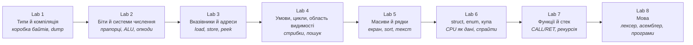

# Основи програмування — комп’ютер, який видно

[English](README.md) · [Українською](README.uk.md)

> «У комп’ютері є лише біти. Типи, імена й мови — це спосіб про них думати.»

**16 тижнів, вісім лабораторних**, розраховано на перший курс: вміння програмувати не потрібно. За семестр ви збираєте **один** маленький віртуальний комп’ютер. На восьмій лабі вже пишете для нього програми текстом — як звичайну мову. Лексер і асемблер ваші: з цього тексту роблять байти, процесор їх виконує. Репозиторій можна клонувати, запустити однією командою — і побачити дамп пам’яті, пікселі в терміналі й Fibonacci на стеку, який ви зробили самі.

У лабах ця програма називається **`ember`**. Це не готова бібліотека і не нова мова — це те, що ви пишете. Назва одна, щоб тексти лаб могли на неї посилатись; свій репозиторій можна назвати інакше. Машина в усіх одна: пам’ять, регістри, екран, асемблер. Відрізняються README, зайві інструкції, якщо захочете, і програми, які ви для неї напишете.

---

## Як влаштований курс

У кожній лабі дві частини, і вони тримаються купи:

1. **Одна ідея** — як програми насправді працюють: коротко, з типовими помилками і кількома дослідами в терміналі.
2. **Один крок `ember`**, без якого ця ідея так і лишилась би слайдом. Байт перескакує з 255 на 0 — ось цілі типи. Інструкція закодована в байті — ось біти. Процесор шукає значення в пам’яті, а не тримає все в регістрах — ось вказівники. Екран це сітка — ось масиви. Набридло тикати hex руками — ось лексер і рядок `ADD A, B`.

Віртуальний комп’ютер зручний тим, що все можна побачити. Переповнення — у дампі. Вилізли за масив — санітайзер сам надрукує звіт. Рекурсія — стек росте, доки не впреться. Текст стає інструкціями, бо ви написали сканер.

Усе робиться в **терміналі**: збираєте через `c++` і `cmake`, `ember` приймає команди, вивід копіюєте в README. Це і є перевірка.

---

## Звідки це взялось

Той самий підхід, що в курсах [Python](../python/README.md) і [JavaScript](../javascript/README.md) у цьому репозиторії: один проєкт на вісім лаб по два тижні. Теорія з’являється тоді, коли без неї не зібрати наступний шматок. Notes можна ганяти на парі. Захист — п’ять хвилин біля екрана.

І ще [École 42](https://42.fr/) та програма на 42 лабораторні: вчишся, коли є що показати.

Саму машину ми склали з кількох джерел:

- **[8-бітний комп’ютер Ben Eater на макетці](https://eater.net/8bit)** — регістри й ALU, які видно руками. Якщо Lab 2 здається абстракцією — подивіться будь-який епізод.
- **[NAND2Tetris](https://www.nand2tetris.org/)** (Nisan і Schocken) — від простих частин до програми. Наші вісім лаб — коротша версія того ж шляху, уже на C++.
- **CHIP-8** — екран 64×32 з бітів; у Lab 5 схожий.
- **[Crafting Interpreters](https://craftinginterpreters.com/)** (Bob Nystrom) — підхід Lab 8: мова починається зі сканера, який з тексту робить токени, а з токенів — байти, які процесор уже вміє виконати.

C++ тут потрібен, щоб бачити байти. Беремо невеликий шматок мови: типи, функції, `struct`, вказівники. Весь C++ за семестр ніхто не вчить.

---

## Проєкт: `ember`

`ember` — звичайна програма на C++, яка грає роль маленького комп’ютера:

- 4096 байтів пам’яті, які можна надрукувати (`dump`)
- кілька регістрів — іменованих комірок, з якими процесор працює просто зараз
- набір інструкцій, який ви додаєте по одній
- з Lab 5 — екран 64×32 символами в терміналі
- з Lab 8 — асемблер: пишете `ADD A, B`, а не набираєте hex

Запуск як у будь-якої консольної програми: `./build/ember`. З’являється prompt — рядок, куди пишете команду. Пишете `dump`, `get 0`, `step`. Пізніше: `./build/ember programs/fib.asm`.



Усі збирають ту саму машину. Відрізняються README, зайві інструкції, якщо захочете, і програми, які ви для неї напишете.

---

## Слова, якими говорять лаби

Прочитайте один раз. Далі тексти вважають, що ці слова вже зрозумілі.

| Слово | Що це тут значить |
|---|---|
| **`ember`** | Назва вашого проєкту — віртуального комп’ютера на C++. Можна перейменувати. |
| **Віртуальна машина (VM)** | Програма, яка поводиться як процесор плюс пам’ять. `ember` якраз така. |
| **Байт** | 8 біт. Одна клітинка пам’яті `ember`. |
| **Dump** | Надрукувати пам’ять шістнадцятковим записом (і ASCII), як утиліта `hexdump`. Команда: `dump`. |
| **Peek / poke** (`get` / `set`) | Прочитати байт за адресою; записати байт за адресою. |
| **CLI / prompt** | Програма в терміналі, якій ви пишете команди. Без окремого вікна, без кнопки Run. |
| **Регістр** | Іменована комірка всередині процесора (`A`, `B`, `PC`), яка тримає значення зараз. |
| **`PC` (program counter)** | Адреса наступної інструкції. |
| **Опкод** | Байт (або шматок байта), який каже, *яка* це інструкція (`ADD`, `HALT`, …). |
| **ALU** | Блок арифметики й логіки: додає, робить AND, зсуває. У нас це функції на C++, які ви пишете. |
| **Гість і хост** (guest / host) | *Гість* — числа всередині `ember` (адреса від 0 до 4095). *Хост* — ваш справжній процес C++ (вказівник `Byte*` на масив). Це різні світи, їх не змішують. |
| **Асемблер** | Програма, яка з тексту на кшталт `ADD A, B` робить байти, які команда `step` уже вміє виконати. |
| **Лексер / сканер** | Перший крок: іде по символах, видає токени або пише помилку з номером рядка. |
| **Санітайзер** | Додаткові перевірки, які компілятор вшиває в програму. Вилізли за масив — програма падає і друкує звіт, а не «ну, 42». |
| **ASan** | **AddressSanitizer** (`-fsanitize=address`). Ловить вихід за межі масиву, читання після `delete`, подвійний `delete`. |
| **UBSan** | **UndefinedBehaviorSanitizer** (`-fsanitize=undefined`). Ловить, зокрема, переповнення знакового `int`. |
| **UB** | Undefined behaviour: мова не обіцяє, що буде. Санітайзери частину цього показують одразу. |
| **CMake** | Збірка проєкту: описуєте його один раз, далі `cmake --build` збирає однаково на macOS, Linux і Windows. |

---

## Вісім лабораторних

| # | Лаба | Notes | Що розумієте | Що з’являється в `ember` |
|---|---|---|---|---|
| 1 | [A Box of Bytes](lab-01-a-box-of-bytes.md) | [notes](lab-01-a-box-of-bytes.notes.md) | Компіляція, типи як розмір, overflow, `const`, символи як числа | Проєкт на CMake, 4 КБ пам’яті, hex-дамп, `get`/`set` |
| 2 | [Bits Don't Lie](lab-02-bits-dont-lie.md) | [notes](lab-02-bits-dont-lie.notes.md) | Двійкова й hex, доповнення до двох, прапорці, бітові операції | ALU, прапорці, розбір опкода, `step` |
| 3 | [Addresses, Not Names](lab-03-addresses-not-names.md) | [notes](lab-03-addresses-not-names.notes.md) | Вказівники, `&`/`*`, `void*`, `sizeof` | `LOAD`/`STORE`, лічильник команд по пам’яті |
| 4 | [The Shape of Control](lab-04-the-shape-of-control.md) | [notes](lab-04-the-shape-of-control.notes.md) | Булеві, `if`/`switch`/`while`/`for`, коротке замикання, блоки | `JMP`/`JZ`, цикл у байткоді, лінійний пошук |
| 5 | [Many of One Thing](lab-05-many-of-one-thing.md) | [notes](lab-05-many-of-one-thing.notes.md) | Масиви, індекс у сітці, рядки, пошук, прості сорти | Екран 64×32, `PLOT`, сортування шматка пам’яті, друк рядка |
| 6 | [Named Bundles](lab-06-named-bundles.md) | [notes](lab-06-named-bundles.notes.md) | `struct`, `enum`, час життя, стек і купа, витоки | `CPU` як `struct`, купа, спрайти |
| 7 | [Call and Return](lab-07-call-and-return.md) | [notes](lab-07-call-and-return.notes.md) | Функції, передача за значенням і за вказівником, стек викликів, рекурсія, заголовки | Стек як окремий тип, `CALL`/`RET`, рекурсивний Fibonacci |
| 8 | [Give It a Language](lab-08-give-it-a-language.md) | [notes](lab-08-give-it-a-language.notes.md) | Токени, сканер, списки, синтаксичні помилки | Лексер і асемблер; `hello`, `search`, `fib`, `bounce` у `.asm` |

Кожна лаба — **два тижні**. Тиждень 16 — показ робіт.

| Тижні | Лаба | Тижні | Лаба |
|---|---|---|---|
| 1–2 | Lab 1 | 9–10 | Lab 5 |
| 3–4 | Lab 2 | 11–12 | Lab 6 |
| 5–6 | Lab 3 | 13–14 | Lab 7 |
| 7–8 | Lab 4 | 15–16 | Lab 8 + показ |

Тексти лаб — англійською. Notes — українською, їх зручно ганяти на парі. Поруч лежить [англійська версія цього файлу](README.md).

---

## З чого складається лаба

Той самий каркас, що в Python- і JavaScript-курсах:

1. **This lab's feature** — що саме берете з цієї лаби і навіщо воно потім.
2. **Notes** — коротка теорія, фрагменти коду, очікуваний вивід. На парі чи вдома. Лабу не замінює.
3. **Theory** — як це влаштовано, типові помилки, досліди. Це читання.
4. **Project step** — що додати в `ember`, етапи, коли можна вважати готовим.
5. **Deliverable checklist** — чекліст здачі.
6. **Reflection** — питання до дошки.
7. **Stretch** — якщо встигаєте раніше за інших.
8. **Resources** — кілька відео й текстів, біля кожного рядок, навіщо саме це.

---

## Правила курсу

- **Самі.** Наприкінці ви маєте тримати всю машину в голові — це і є сенс.
- **Один репозиторій з першого дня.** Публічний GitHub, коміти по ходу, тег після кожної лаби (`lab-01`, `lab-02`, …).
- **README здаєте разом із кодом.** Після кожної лаби — розділ: що зробили, вивід з термінала, що здивувало. На Lab 8 це вже розповідь про весь проєкт.
- **Працюємо в терміналі.** Збірка, запуск, перевірка. Фрагменти з notes — `c++ … scratch.cpp`. `ember` — програма, якій пишете команди. Доказ — **скопійований вивід** (і повідомлення санітайзера).
- **Після кожної лаби — п’ять хвилин захисту.** Показати, що з’явилось; відповісти на 2–3 питання з Reflection. Рядок, який не можете пояснити, не рахується.
- **AI-асистенти** — за [правилами програми](../../README.md). Щоб швидше розібратись, не щоб обійти розуміння.
- **Санітайзери не вимикаємо.** Якщо поведінка невизначена, програма не «працює», навіть коли щось надрукувала.

---

## Чим збираємо

- **C++17** або новіший. Беремо типи, функції, `struct`, вказівники. Без ієрархій класів. `std::vector` і `std::string` можна порівняти зі своїм кодом *після* того, як зробили річ руками.
- **CMake**

  ```bash
  cmake -S . -B build -DCMAKE_BUILD_TYPE=Debug
  cmake --build build
  ./build/ember
  ```

- **clang або gcc** у терміналі (`c++`, `clang++` чи `g++`):  
  `-std=c++17 -Wall -Wextra -Werror -fsanitize=address,undefined`  
  На Windows зручніше WSL (або інша Unix-оболонка), інакше ASan/UBSan часто не живуть.
- **Досліди з notes**

  ```bash
  c++ -std=c++17 -Wall -Wextra -Werror -fsanitize=address,undefined scratch.cpp -o scratch && ./scratch
  ```

  Той самий рядок стоїть на початку [Notes 01](lab-01-a-box-of-bytes.notes.md).
- **clang-format** — оберіть стиль на Lab 1 і забудьте.
- **Дебагер не обов’язковий.** Якщо вже берете — `lldb` або `gdb` у тому ж терміналі. Обов’язково — надрукувати байт через `get` або `std::cout`.
- **[Compiler Explorer](https://godbolt.org/)** — за бажанням у Stretch. Обов’язкові завдання робимо в своєму терміналі.

---

## Що почитати й подивитись

Усе потрібне безкоштовне.

- **[Ben Eater — 8-bit breadboard computer](https://eater.net/8bit)** — те саме, що Labs 2–3, тільки залізом на столі.
- **[NAND2Tetris](https://www.nand2tetris.org/)** — від частин до програми.
- **[learncpp.com](https://www.learncpp.com/)** — найкращий безкоштовний підручник C++, щоб підглянути синтаксис. Не треба проходити його як окремий курс.
- **[cppreference.com](https://en.cppreference.com/)** — довідник мови. Шукайте потрібне, не читайте все підряд.
- **K&R, *The C Programming Language*** — коротко. Розділи 1–5 перетинаються з Labs 1–5.
- **[Crafting Interpreters](https://craftinginterpreters.com/)** — сканер і токени (Lab 8). Lox збирати не треба — нам важливий сам підхід.
- **[CS:APP](https://csapp.cs.cmu.edu/)** — біти, пам’ять, машинний код, коли захочеться глибше на Labs 2–3.
- **Crash Course Computer Science** — двійкова система, регістри, машинний код за десять хвилин.

---

## Що зможете сказати наприкінці

- *«Ось віртуальний комп’ютер на 4 КБ. Ось дамп, ось лічильник команд, ось піксель, який я поставив.»*
- *«Інструкції — це байти. Я виймаю поля масками і складаю ADD по бітах, а через звичайний `+` у C++ перевіряю себе.»*
- *«Виклик функції — не магія: `CALL` кладе адресу повернення, `RET` знімає. Можу показати, як Fibonacci переповнює стек.»*
- *«Лексер з `ADD A, B` робить токени, асемблер з токенів — байти, які процесор уже розумів.»*
- *«Можу пояснити доповнення до двох, чому `0.1 + 0.2` не дорівнює `0.3`, що таке вказівник, і що написав AddressSanitizer, коли я вийшов за масив.»*

Починайте з [Lab 1](lab-01-a-box-of-bytes.md).
