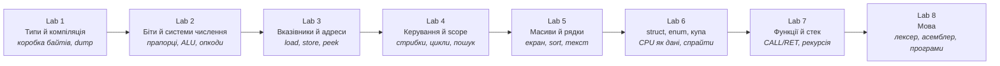

# Основи програмування — комп’ютер, який видно

[English](README.md) · [Українською](README.uk.md)

> «Комп’ютер — машина, яка рухає біти. Типи, імена й мови — історії про ці біти, щоб нам було чим думати.»

Курс на **16 тижнів, 8 лабораторних**, для **першого курсу**. Програмувати раніше не обов’язково. За семестр ви будуєте **одну машину**: маленький віртуальний комп’ютер. На Lab 8 пишете для нього програми мовою, яку *самі* розібрали на токени й зібрали в байти. Рекрутер клонує репозиторій, запускає одну команду — і бачить дамп пам’яті, пікселі й Fibonacci на стеку, який ви реалізували.

Робоча назва машини — **`ember`**. Це не бібліотека і не мова програмування. Це програма, *яку пишете ви*; ім’я потрібне, щоб усі лаби показували на одне й те саме. Свій проєкт назвіть як завгодно. Тема вільна: бортовий комп’ютер, ігрова консоль, калькулятор, який вийшов з-під контролю.

---

## Як ми думаємо про курс

Кожна лаба має дві половини, які потребують одна одну:

1. **Одна ідея про те, як насправді працюють програми** — ментальна модель, що робить машина, типові пастки й кілька дослідів у терміналі, поки ідея не стане нудною.
2. **Один крок `ember`**, якого *немає без цієї ідеї*. Цілі числа з’являються, коли байт переходить з 255 у 0. Біти — коли інструкція це байт, який треба розібрати. Вказівники — коли CPU має *знайти* значення, а не тримати його в кишені. Масиви — коли екран це сітка пікселів. Лексер — коли тикати hex руками вже нестерпно і хочеться написати `ADD A, B`.

Віртуальний комп’ютер тут тому, що важливе не лишається метафорою. Переповнення видно в дампі. Вихід за масив — репорт санітайзера, який ви викликали навмисне. Рекурсія — стек, який росте, доки не впреться. Текст, що стає інструкціями, — сканер, який ви написали.

Робота — у **терміналі**: збираєте через `c++` / `cmake`, з `ember` розмовляєте командами, вивід вставляєте в README. Цей вивід і є перевірка.

---

## На що спирались

Курс з тієї ж родини, що [Python](../python/README.md) і [JavaScript](../javascript/README.md) у цьому репозиторії: **один проєкт, вісім двотижневих лаб**, теорія з’являється, бо наступна фіча без неї не живе; notes, які можна ганяти на парі; п’ятихвилинний захист замість паперового іспиту.

Ширша програма на 42 лабораторні — і за нею [École 42](https://42.fr/) — задає поставу: вчишся, коли здаєш річ, яку можна показати.

Саму *машину* ми вільно позичили з кількох місць:

- **[Бортовий комп’ютер Бена Ітера на макетній платі](https://eater.net/8bit)** — регістри й ALU, на які можна ткнути пальцем. Якщо Lab 2 відчувається абстрактно — подивіться епізод.
- **[NAND2Tetris](https://www.nand2tetris.org/)** (Nisan & Schocken) — комп’ютер від простих частин до програми. Ці вісім лаб — стиснутий, C++-смаковий родич середини того шляху.
- **CHIP-8** — екран 64×32 з бітів; екран Lab 5 з тієї ж сім’ї.
- **[Crafting Interpreters](https://craftinginterpreters.com/)** (Bob Nystrom) — постава Lab 8: мова починається зі сканера, який робить з тексту токени, а з токенів — байти, які CPU вже вміє виконувати.

C++ тут — скло: невелика підмножина (типи, функції, struct, вказівники), щоб *було видно байти*. Це не екскурсія всією мовою.

---

## Проєкт: `ember`

`ember` — програма на C++, яка *удає маленький комп’ютер*:

- 4096 байтів оперативки, які можна надрукувати (`dump`)
- кілька регістрів (іменовані комірки, якими CPU користується зараз)
- набір інструкцій, який ви ростите опкод за опкодом
- з Lab 5 — екран 64×32, намальований символами в терміналі
- з Lab 8 — асемблер: пишете `ADD A, B`, а не тикаєте hex

Запуск як у будь-якої консольної програми: `./build/ember`. З’являється prompt. Пишете `dump`, `get 0`, `step`. Пізніше: `./build/ember programs/fib.asm`.



Усі будують *той самий рід* машини. Ваш голос — тема, додаткові опкоди, програми для неї і README, який розповідає історію.

---

## Слова, якими говорять лаби

Прочитайте раз. Далі лаби вважають ці значення відомими.

| Слово | Що воно значить тут |
|---|---|
| **`ember`** | Назва *вашого* проєкту — віртуального комп’ютера, який ви пишете на C++. Можна перейменувати. |
| **Віртуальна машина (VM)** | Програма, яка поводиться як CPU + пам’ять. `ember` і є VM. |
| **Байт** | 8 біт. Одна клітинка оперативки `ember`. |
| **Dump** | Надрукувати пам’ять hex-ом (і ASCII), як утиліта `hexdump`. Команда: `dump`. |
| **Peek / poke** (`get` / `set`) | Прочитати байт за адресою; записати байт за адресою. |
| **CLI / prompt** | Програма в терміналі, якій ви пишете команди. Без вікна, без кнопки Run. |
| **Регістр** | Іменована комірка всередині CPU (`A`, `B`, `PC`), яка тримає значення *зараз*. |
| **`PC` (program counter)** | Адреса *наступної* інструкції. |
| **Опкод** | Байт (або поле байта), який означає «яка це інструкція» (`ADD`, `HALT`, …). |
| **ALU** | Арифметико-логічний пристрій: додає, робить AND, зсуває — у нас це функції на C++, які ви пишете. |
| **Guest vs host** | *Guest* — числа всередині `ember` (адреса `0…4095`). *Host* — ваш справжній процес C++ (`Byte*` у масив). Не змішуйте. |
| **Асемблер** | Програма, яка з тексту (`ADD A, B`) робить байти, які `step` уже вміє виконувати. |
| **Лексер / сканер** | Перший етап: іде по символах, видає токени або помилку з номером рядка. |
| **Санітайзер** | Додаткові перевірки, вшиті в бінарник під час збірки. Вийшли за масив — програма падає і друкує звіт, а не «ну, 42». |
| **ASan** | **AddressSanitizer** (`-fsanitize=address`). Ловить вихід за межі, читання після `delete`, подвійний `delete`. |
| **UBSan** | **UndefinedBehaviorSanitizer** (`-fsanitize=undefined`). Ловить, зокрема, переповнення знакового `int`. |
| **UB** | Undefined behaviour: мова не обіцяє, що буде. Санітайзери частину цього роблять видимою. |
| **CMake** | Система збірки: описуєте проєкт один раз, далі `cmake --build` збирає однаково на кожній ОС. |

---

## Вісім лабораторних

| # | Лаба | Notes | Що розумієте | Що додаєте в `ember` |
|---|---|---|---|---|
| 1 | [A Box of Bytes](lab-01-a-box-of-bytes.md) | [notes](lab-01-a-box-of-bytes.notes.md) | Компіляція, типи як розміри, overflow, `const`, символи як числа | Проєкт CMake, 4 КБ пам’яті, hex-дамп, peek/poke |
| 2 | [Bits Don't Lie](lab-02-bits-dont-lie.md) | [notes](lab-02-bits-dont-lie.notes.md) | Двійкова/hex, доповнення до двох, прапорці, бітові операції | ALU, регістр прапорців, розбір опкода, `step` |
| 3 | [Addresses, Not Names](lab-03-addresses-not-names.md) | [notes](lab-03-addresses-not-names.notes.md) | Вказівники, `&`/`*`, `void*`, `sizeof`, арифметика вказівників | `LOAD`/`STORE`, лічильник команд, що ходить по пам’яті |
| 4 | [The Shape of Control](lab-04-the-shape-of-control.md) | [notes](lab-04-the-shape-of-control.notes.md) | Булеві, `if`/`switch`/`while`/`for`, short-circuit, блоки | `JMP`/`JZ`, цикл у байткоді, лінійний пошук |
| 5 | [Many of One Thing](lab-05-many-of-one-thing.md) | [notes](lab-05-many-of-one-thing.notes.md) | Масиви, 2D-індекс, рядки, пошук, прості сорти | Екран 64×32, `PLOT`, сортування регіону, друк рядка |
| 6 | [Named Bundles](lab-06-named-bundles.md) | [notes](lab-06-named-bundles.notes.md) | `struct`, `enum`, час життя, стек vs купа, витоки | `CPU` як struct, купа, спрайти |
| 7 | [Call and Return](lab-07-call-and-return.md) | [notes](lab-07-call-and-return.notes.md) | Функції, значення vs вказівник, стек викликів, рекурсія, заголовки | ADT `Stack`, `CALL`/`RET`, рекурсивний Fibonacci |
| 8 | [Give It a Language](lab-08-give-it-a-language.md) | [notes](lab-08-give-it-a-language.notes.md) | Токени, сканер, списки, АТД, синтаксичні помилки | Лексер + асемблер; `hello`, `search`, `fib`, `bounce` як `.asm` |

Кожна лаба — **два тижні**. Тиждень 16 — показ.

| Тижні | Лаба | Тижні | Лаба |
|---|---|---|---|
| 1–2 | Lab 1 | 9–10 | Lab 5 |
| 3–4 | Lab 2 | 11–12 | Lab 6 |
| 5–6 | Lab 3 | 13–14 | Lab 7 |
| 7–8 | Lab 4 | 15–16 | Lab 8 + показ |

Самі лаби — англійською; `.notes.md` — українською (пара, вставив і запустив). Цей файл має [англійського близнюка](README.md).

---

## Як виглядає кожна лаба

Той самий каркас, що в Python- і JavaScript-курсах:

1. **This lab's feature** — що опановуєте і навіщо це поза проєктом.
2. **Notes** — короткий супутник: теорія, фрагменти, очікуваний вивід. На парі чи вдома; лабу не замінює.
3. **Theory** — модель, що під капотом, пастки, досліди. Це читання.
4. **Project step** — що додати в `ember`, етапи, визначення «готово».
5. **Deliverable checklist**
6. **Reflection** — пояснити біля дошки.
7. **Stretch** — за бажанням, якщо ви попереду.
8. **Resources** — кілька розмов і розділів, кожне з рядком «навіщо саме це».

---

## Правила курсу

- **Самостійно.** Наприкінці вся машина має бути у вас у голові — це і є сенс.
- **Один репозиторій з першого дня.** Публічний GitHub. Комітити по ходу. Тег на кожну лабу (`lab-01`, `lab-02`, …).
- **README — частина здачі.** Кожна лаба додає розділ: що збудували, вставлений вивід термінала, що здивувало. На Lab 8 це історія комп’ютера.
- **Лише термінал.** Збірка, запуск, перевірка з оболонки. Notes → `c++ … scratch.cpp`. `ember` → prompt. Доказ — **вставлений stdout** (і репорти санітайзера).
- **Кожна лаба закінчується 5-хвилинним захистом.** Показати крок; відповісти на 2–3 питання Reflection. Рядок, який не можете пояснити, не рахується.
- **AI-асистенти** — за [правилами програми](../../README.md). Щоб учитись швидше, не щоб обійти розуміння.
- **Санітайзери завжди ввімкнені.** Програма з undefined behaviour не «працює», навіть якщо щось надрукувала.

---

## Інструменти

- **C++17** (або новіший). Підмножина: типи, функції, struct, вказівники. Без ієрархій класів. `std::vector` / `std::string` можна *порівняти*, коли вже зробили річ руками.
- **CMake**

  ```bash
  cmake -S . -B build -DCMAKE_BUILD_TYPE=Debug
  cmake --build build
  ./build/ember
  ```

- **clang або gcc** у терміналі (`c++`, `clang++` чи `g++`):  
  `-std=c++17 -Wall -Wextra -Werror -fsanitize=address,undefined`  
  На Windows — WSL (або інша Unix-подібна оболонка), щоб працювали ASan/UBSan.
- **Досліди з notes**

  ```bash
  c++ -std=c++17 -Wall -Wextra -Werror -fsanitize=address,undefined scratch.cpp -o scratch && ./scratch
  ```

  Той самий рядок стоїть на початку [Notes 01](lab-01-a-box-of-bytes.notes.md).
- **clang-format** — оберіть стиль на Lab 1 і більше про нього не думайте.
- **Дебагер необов’язковий.** Якщо вже берете — `lldb` або `gdb` у тому ж терміналі. Обов’язковий доказ — друк байта через `get` / `std::cout`.
- **[Compiler Explorer](https://godbolt.org/)** — за бажанням у Stretch. Обов’язковий шлях з оболонки не виходить.

---

## Полиця ресурсів

Усе потрібне безкоштовне.

- **[Ben Eater — 8-bit breadboard computer](https://eater.net/8bit)** — апаратний близнюк Labs 2–3.
- **[NAND2Tetris](https://www.nand2tetris.org/)** — від частин до програми.
- **[learncpp.com](https://www.learncpp.com/)** — найкращий безкоштовний підручник C++ на перший прохід. Довідник, не силабус.
- **[cppreference.com](https://en.cppreference.com/)** — сама мова. Грепайте, не читайте від кірки до кірки.
- **K&R, *The C Programming Language*** — коротко й щільно. Розділи 1–5 перетинаються з Labs 1–5.
- **[Crafting Interpreters](https://craftinginterpreters.com/)** — сканування й токени (Lab 8). Lox ви не пишете; поставу — так.
- **[CS:APP](https://csapp.cs.cmu.edu/)** — біти, пам’ять, машинний код, коли хочеться глибше на Labs 2–3.
- **Crash Course Computer Science** — двійкова система, регістри, машинний код за десять хвилин.

---

## Що зможете сказати наприкінці

- *«Я зібрав віртуальний комп’ютер на 4 КБ. Ось дамп, ось лічильник команд, ось піксель, який я поставив.»*
- *«Інструкції — це байти. Я розбираю їх масками і роблю ADD бітами — і ще перевіряю через `+` у C++.»*
- *«Функції — не магія: `CALL` кладе адресу повернення, `RET` знімає. Можу показати, як Fibonacci переповнює стек.»*
- *«Я написав лексер, який з `ADD A, B` робить токени, і асемблер, який з токенів робить байти, які CPU вже розумів.»*
- *«Можу пояснити доповнення до двох, чому `0.1 + 0.2` не `0.3`, що таке вказівник, і що надрукував AddressSanitizer, коли я вийшов за масив.»*

Починайте з [Lab 1](lab-01-a-box-of-bytes.md).
