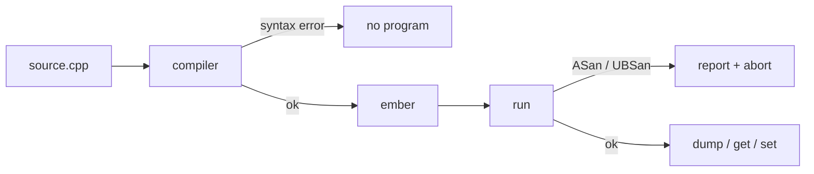

# Notes 01 — Типи, компіляція, коробка байтів

Поруч із лабою: [lab-01-a-box-of-bytes.md](lab-01-a-box-of-bytes.md).

Лаба — **що здати** (CMake, dump, peek/poke, тег). Цей файл — **з чим розібратись**: коротка теорія і досліди. Підходить і на парі, і вдома.

Як проходити: маленький `scratch.cpp` або вже зібраний `ember`. Перед **кожним** дослідом скажи вголос, що очікуєш. Зробив параграф — **зупинись**, звіряй вивід, далі. Проєкт (CMake, M1–M4) — **після §4**, не замість.

| | Зроби зараз | Зупинись, коли |
|---|---|---|
| **§1** | `sizeof` усіх типів | числа *твоєї* машини в голові |
| **§2** | `uint8_t` wrap vs signed overflow + sanitizer | розумієш, *чому* пам’ять — unsigned |
| **§3** | `0.1 + 0.2` | `== 0.3` це `false`, і це не баг компілятора |
| **§4** | `65`, `0x41`, `'A'` | ті самі біти, різні історії |

Здача лаби — окремо, коли типи вже не сюрприз:

| | Що зробити | Як перевірити очима |
|---|---|---|
| **M1** | CMake + sanitizers + breakpoint | програма вітається; у README є команда дебагера |
| **M2** | `dump` 4096 нулів | hex + ASCII, як `hexdump -C` |
| **M3** | `set 0 65` / `get 0` | `65  0x41  0b01000001  'A'` |
| **M4** | три поломки | wrap, float, `"AB\0"` у дампі |

**Байт** — 8 біт, клітинка пам’яті `ember`. **Тип** — скільки байтів і які операції; пам’ять про тип не знає. **Компілятор** — перекладач з C++ на машинний код. **UB** (undefined behaviour) — мова не обіцяє, що буде; sanitizer ловить частину цього в рантаймі. **ASan / UBSan** — Address- і UndefinedBehavior-sanitizer: бібліотеки, які підмішують у бінарник перевірки. **Літерал** — значення, написане в коді (`65`, `'A'`). **`const`** — ім’я, через яке ці біти не змінять.

---

## Ідея

Комп’ютер не знає про «цілі числа». Він знає **байти**. Тип — це обіцянка, як їх читати. `int` зазвичай 4 байти, `char` — один, і той самий байт `01000001` це і 65, і літера `'A'`.

Ти пишеш текст. Компілятор перекладає. Помилка синтаксису — перекладу не було. Попередження — «законно, але підозріло»; у нас `-Werror`. Помилка виконання — програма вже біжить і робить щось недозволене: виліт за масив, неініціалізоване читання. Саме для цього sanitizers.



У `ember` це видно одразу: 4096 байтів, команда `get` друкує **чотири** погляди на одну клітинку.

---

## 1. `sizeof` — ширина на *цій* машині

Не вчи таблицю з підручника. Надрукуй.

### Спробуй

```cpp
#include <iostream>
#include <cstdint>
int main() {
    std::cout << sizeof(char) << ' ' << sizeof(int) << ' '
              << sizeof(float) << ' ' << sizeof(double) << ' '
              << sizeof(void*) << '\n';
    std::cout << sizeof(std::uint8_t) << ' ' << sizeof(std::uint16_t) << '\n';
}
```

**Очікуй** (типовий 64-bit): `1 4 4 8 8` і `1 2`. Якщо інакше — пиши *своє* в README. `std::uint8_t` завжди 1; саме тому клітинка VM — він, а не «просто `int`».

---

## 2. Переповнення: wrap vs UB

Unsigned 8-bit: після 255 йде 0. Це **визначено**. Signed `int` overflow — **UB**; з UBSan програма може впасти, без нього — «працювати» дивно.

### Спробуй

```cpp
#include <iostream>
#include <cstdint>
int main() {
    std::uint8_t u = 255;
    u = static_cast<std::uint8_t>(u + 1);
    std::cout << (int)u << '\n';          // 0

    int s = 2147483647;
    s = s + 1;                            // UBSan: signed overflow
    std::cout << s << '\n';
}
```

Збирай з `-fsanitize=undefined`. **Очікуй:** перший рядок `0`; другий — репорт UBSan.

**Навіщо в ember:** клітинки пам’яті — `uint8_t`. ALU наступної лаби теж wrap. Signed `int` для лічильників у *хості* (C++), не для байтів гостя.

---

## 3. Дробові — науковий запис у двійковій

Більшість десяткових дробів не мають точного бітового запису.

### Спробуй

```cpp
#include <iostream>
int main() {
    std::cout << (0.1 + 0.2) << '\n';
    std::cout << std::boolalpha << (0.1 + 0.2 == 0.3) << '\n';
}
```

**Очікуй:** щось на кшталт `0.3` на екрані (округлення друку) і `false` в порівнянні.

**Навіщо:** пікселі, адреси, лічильники — цілі. `float` лише коли справді приблизна величина.

---

## 4. Символ — число з костюмом

ASCII `'A'` = 65 = `0x41`.

### Спробуй

```cpp
#include <iostream>
int main() {
    std::cout << 65 << ' ' << 0x41 << ' '
              << static_cast<int>('A') << ' '
              << static_cast<char>(65) << '\n';
    std::cout << static_cast<char>('A' + 1) << '\n';
    std::cout << 5 / 2 << ' ' << 5 / 2.0 << '\n';
}
```

**Очікуй:** `65 65 65 A`, потім `B`, потім `2 2.5`. Цілочисельне ділення **відкидає** дріб.

`int x;` без ініціалізації — сміття. Завжди `int x = 0;` або `Byte data[4096]{}` — фігурні дужки **занулюють** коробку ember.

---

## У проєкті `ember`

| Ідея | Де дивитись |
|---|---|
| 4096 нулів | `src/memory.cpp` — `{}` на масиві |
| чотири погляди на байт | `get` |
| hex + ASCII | `dump` |
| sanitizers | `CMakeLists.txt` Debug |

**M1 зроблено**, якщо не відкриваючи код: `./build/ember` дає prompt, `dump` — сторінка нулів.

M4 (wrap, float, `"AB\0"`) — у README, код знову чистий.

---

## На співбесіді / захисті

- Що робить компілятор? Яку помилку він *не* зловить?
- Чому `sizeof(int)` може відрізнятись, а `sizeof(std::uint8_t)` — ні?
- Чому signed overflow — UB, а `uint8_t` wrap — ні?
- Чому `0.1 + 0.2 != 0.3`?
- Три типи, якими можна прочитати біти `01000001`.

Дослід §4 на папері без підглядання ≈ перше питання про типи.

---

## Якщо мало часу

Три запуски: §1, §2, §4. Потім `set 0 65` / `get 0`. Решту — з лаби, секція Theory.
