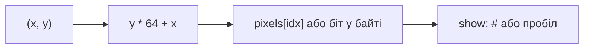

# Notes 05 — Масиви, рядки, екран, сортування

Поруч із лабою: [lab-05-many-of-one-thing.md](lab-05-many-of-one-thing.md).

Лаба — **що здати** (64×32, `PLOT`, `OUTS`, `sort`, тег). Цей файл — індекс як формула.

| | Зроби зараз | Зупинись, коли |
|---|---|---|
| **§1** | `sizeof(масив)` vs `sizeof(вказівник)` | decay |
| **§2** | `y * W + x` | те саме, що `m[y][x]` |
| **§3** | рядок без `'\0'` | ASan або сміття |
| **§4** | один прохід бульбашки на папері | своп сусідів |

**Stride** — скільки елементів пропустити, щоб спуститись на наступний рядок (`WIDTH`). **C-string** — байти до нуля. **Decay** — ім’я масиву в більшості виразів стає вказівником на перший елемент; розмір губиться.

---

## Ідея

Пам’ять ember уже масив. Цього тижня ти ним користуєшся як програміст: `i`-й, сітка, текст, свопи.

Двовимірності в RAM немає. Є формула:

```txt
index = y * WIDTH + x
```



Екран — та сама «матриця» з практичних, тільки її хочеться дивитись.

---

## 1. Масив і згасання до вказівника

### Спробуй

```cpp
#include <iostream>
int main() {
    int a[] = {1, 2, 3};
    std::cout << sizeof(a) << ' ' << sizeof(&a[0]) << '\n';
}
```

**Очікуй:** `12 8` на 64-bit (`3*4` проти ширини вказівника). Тому в функцію передають `buf` **і** `size`. `buf[i]` це `*(buf + i)` (Lab 3).

`Byte buf[8];` без `{}` — сміття. `Byte buf[8]{};` — нулі.

---

## 2. Сітка — один масив

### Спробуй

```cpp
#include <iostream>
int main() {
    int m[2][3] = {{1,2,3},{4,5,6}};
    int* base = &m[0][0];
    std::cout << m[1][2] << ' ' << *(base + 1 * 3 + 2) << '\n';
}
```

**Очікуй:** `6 6`. `1*3+2` — рядок 1, колонка 2, **ряд-мажор** (рядки лежать шматком).

`plot(x,y)` — один рядок: перевірка меж і `pixels[y * WIDTH + x] = 1` (або бітова маска з Lab 2).

---

## 3. Рядки

`"AB"` це три байти: `65 66 0`.

### Спробуй

```cpp
#include <iostream>
int main() {
    char s[] = "AB";
    std::cout << (int)s[0] << ' ' << (int)s[1] << ' ' << (int)s[2] << '\n';
    s[2] = 'X';
    std::cout << s << '\n';   // немає термінатора — UB / ASan
}
```

З ASan **очікуй:** репорт на другому друці, або сміття без sanitizer. Тому `OUTS` має **стелю** (max байтів або `MEM_SIZE`), не лише `'\0'`.

`'0' + 3` це `'3'` — надрукувати одну цифру без форматера.

---

## 4. Бульбашка — вкладений цикл і tmp

Масив `4 1 3 2`. Перший прохід сусідів: порівняли (4,1)→`1 4 3 2`, (4,3)→`1 3 4 2`, (4,2)→`1 3 2 4`. Найбільший «виплив» управо.

### Спробуй

```cpp
#include <iostream>
int main() {
    int a[] = {4, 1, 3, 2};
    int n = 4;
    for (int i = 0; i < n; ++i)
        for (int j = 0; j < n - i - 1; ++j)
            if (a[j] > a[j + 1]) {
                int t = a[j]; a[j] = a[j + 1]; a[j + 1] = t;
            }
    for (int i = 0; i < n; ++i) std::cout << a[i] << ' ';
}
```

**Очікуй:** `1 2 3 4`. У ember — те саме на `mem.get/set` у діапазоні `[lo, hi)`.

Insertion sort: взяти наступний, зсунути більших управо. На вже відсортованому майже не свопає — корисне питання на захисті.

---

## У проєкті `ember`

| Ідея | Де |
|---|---|
| 64×32 | `display.cpp` |
| `PLOT`/`CLS` | опкоди + `show` |
| `HELLO\0` | `OUTS` з cap |
| `sort lo hi` | бульбашка або вставки |

Рамка з хоста (чотири цикли) — перша фотографія екрана. Три пікселі з гостьової програми — доказ, що опкод живий.

Бітова упаковка: 64×32×1 біт = 256 байт. Байт на піксель = 2048. Lab 2 тут не «для галочки».

---

## На захисті

- `buf[i]` як арифметика вказівників. Чому `sizeof` різний?
- Чому `y * W + x`, не навпаки?
- Чому cap на `OUTS`?
- Бульбашка vs вставки на відсортованому масиві.
- Скільки байтів екран 1-bit vs 8-bit?

---

## Якщо мало часу

§2, §3, рамка на `show`. Sort — з лаби M4.
