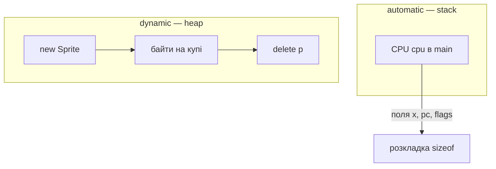

# Notes 06 — struct, enum, купа, спрайти

Поруч із лабою: [lab-06-named-bundles.md](lab-06-named-bundles.md).

Лаба — **що здати** (CPU як struct, спрайти, bump-heap, три репорти sanitizer). Фрагмент → `scratch.cpp`, збірка як у [Notes 01](lab-01-a-box-of-bytes.notes.md). Репорт ASan/LSan — це stdout/stderr термінала.

| | Зроби зараз | Зупинись, коли |
|---|---|---|
| **§1** | `sizeof` struct з `char`+`int` | padding ≠ 5 |
| **§2** | `enum class` = `1` | не компілиться без касту |
| **§3** | use-after-free | ASan |
| **§4** | `new` без `delete` | LeakSanitizer |
| **§5** | два спрайти в масиві | рухаються, `plot` |

**Padding** — дірки в struct заради вирівнювання. **Bump allocator** — «відріж n байт від вершини купи, вершину посунь»; `free` немає. **Dangling** — вказівник живий, об’єкт уже ні. **Витік** — об’єкт живий, вказівника вже ні.

---

## Ідея

Набір полів поруч — `struct`. Набір імен для малих цілих — `enum class`. Час життя: стек (автоматичний) проти купи (`new`/`delete` або регіон усередині 4 КБ).



Спрайт — це `Sprite { x, y, vx, vy, alive }`. Кілька спрайтів — масив таких записів.

---

## 1. Розкладка

### Спробуй

```cpp
#include <iostream>
struct P { char c; int n; };
int main() {
    std::cout << sizeof(P) << ' ' << sizeof(char) + sizeof(int) << '\n';
}
```

**Очікуй:** часто `8 5`. Компілятор вставляє байти, щоб `n` стояв на межі 4. Надрукуй `&p.c` і `&p.n` (різниця) — це і є лекція.

`Sprite s{10, 5, 1, 0, true};` — агрегатна ініціалізація; хвіст без значень стає нулем.

---

## 2. `enum class`

### Спробуй

```cpp
#include <iostream>
enum class Op : unsigned char { Halt = 0, Add = 0x10 };
int main() {
    Op o = Op::Add;
    // o = 1;            // розкоментуй: c++ … має впасти на компіляції
    o = static_cast<Op>(0x10);
    std::cout << static_cast<int>(o) << '\n';
}
```

**Очікуй:** `16`. З розкоментованим `o = 1` — помилка компілятора в терміналі, не рантайм. Опкоди з Lab 2 переїжджають сюди; `switch` на `Op`.

---

## 3. Use-after-free

### Спробуй

```cpp
#include <iostream>
int main() {
    int* p = new int{42};
    std::cout << *p << '\n';
    delete p;
    std::cout << *p << '\n';   // dangling
}
```

З ASan **очікуй:** репорт на другому читанні. Після `delete` — `p = nullptr`.

Подвійний `delete p; delete p;` — інший репорт. І не роби так.

---

## 4. Витік

```cpp
int main() {
    new int{1};   // забули вказівник
}
```

```bash
c++ -std=c++17 -fsanitize=address scratch.cpp -o scratch
ASAN_OPTIONS=detect_leaks=1 ./scratch
```

`ASAN_OPTIONS=detect_leaks=1` (Linux/clang; на Apple буває інакше — тоді достатньо свідомого `new`/`delete` у write-up). **Очікуй:** leak report. Об’єкт є, імені немає.

---

## 5. Масив записів

```cpp
#include <iostream>
struct Sprite { int x, y, vx, vy; bool alive; };
int main() {
    Sprite s[2] = {{0,0,1,0,true},{10,5,-1,0,true}};
    for (int i = 0; i < 2; ++i) {
        if (!s[i].alive) continue;
        s[i].x += s[i].vx;
        std::cout << i << ' ' << s[i].x << '\n';
    }
}
```

**Очікуй:** `0 1` і `1 9`. У ember після руху — `plot` і `show` у тому ж терміналі. Відскок від краю: якщо `x==0` або `x==63`, `vx = -vx`.

---

## Купа всередині ember

Регіон `[0x0C00, 0x0FFF)`, вказівник `heap_ptr`. `alloc n`: якщо влізає — повернути старий `heap_ptr`, додати `n`. Інакше помилка. `free` не обов’язковий: bump так і живе. Два alloc підряд — два шматки в дампі без дірок між ними.

`new` у C++ — щоб sanitizer навчив. `alloc` усередині ember — щоб у VM була своя купа.

`CPU&` у `step` — не копіювати всю машину (Lab 7 уже тут: посилання).

---

## У проєкті `ember`

| Ідея | Де |
|---|---|
| `struct CPU`, `Flags`, `enum class Op` | рефакторинг без нової поведінки |
| `sprites[8]`, `tick` | відскок |
| `alloc` | bump |
| три репорти | README, зламані команди прибрати перед тегом |

---

## На захисті

- Намалюй `Sprite`. Де padding? Як дізнався?
- `enum` vs `enum class` vs `#define`.
- Стек vs купа: хто створює, хто знищує.
- Витік vs dangling vs double-free — який репорт який.
- Чому bump без `free` ще ок для ember?
- Чому `step(CPU&)` а не `step(CPU)`?

---

## Якщо мало часу

§1, §3, два спрайти на екрані. Купа всередині ember — з лаби M3.
