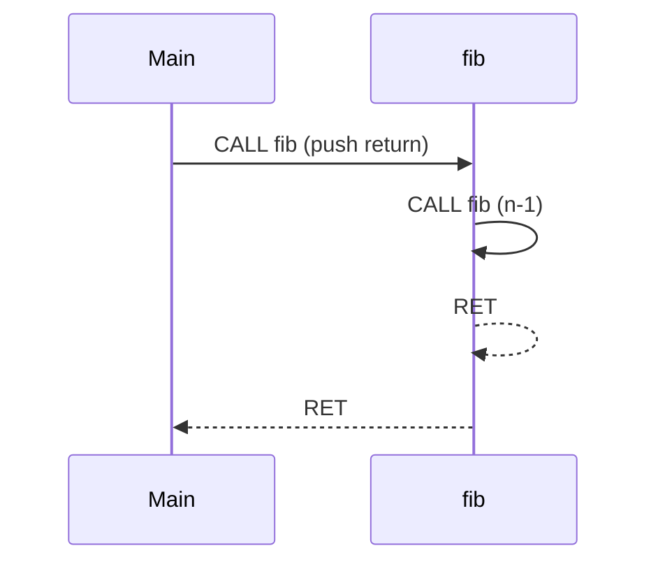

# Notes 07 — Функції, стек, рекурсія, заголовки

Поруч із лабою: [lab-07-call-and-return.md](lab-07-call-and-return.md).

Лаба — **що здати** (`Stack` ADT, `CALL`/`RET`, fib, кілька `.cpp`). Фрагмент → `scratch.cpp`, збірка як у [Notes 01](lab-01-a-box-of-bytes.notes.md). Лінкер — теж термінал: `c++ a.cpp b.cpp`.

| | Зроби зараз | Зупинись, коли |
|---|---|---|
| **§1** | value vs ref vs pointer | лише pointer/ref змінює викликача |
| **§2** | `fact` з друком туди-назад | три кадри на папері |
| **§3** | два визначення `push` | помилка лінкера |
| **§4** | overflow стека | твоє повідомлення або crash, задокументований |

**Кадр (frame)** — локальні змінні + адреса повернення одного виклику. **ADT** — інтерфейс (`push`/`pop`), представлення сховано. **Calling convention** — хто кладе аргументи, хто рятує `A`. **`#pragma once`** — не вставляти заголовок двічі в один `.cpp`.

---

## Ідея

Функція — іменований стрибок із обіцянкою повернутись. Обіцянку тримає **стек**: `CALL` кладе `PC` наступної інструкції, `RET` дістає.



Рекурсія — це не магія: кожен виклик має **свій** кадр. Без бази — росте, поки не впреться в `CAP` або в OS.

---

## 1. Як передати значення

### Спробуй

```cpp
#include <iostream>
void by_val(int x) { x++; }
void by_ref(int& x) { x++; }
void by_ptr(int* p) { *p += 1; }
int main() {
    int a = 1, b = 1, c = 1;
    by_val(a); by_ref(b); by_ptr(&c);
    std::cout << a << ' ' << b << ' ' << c << '\n';
}
```

**Очікуй:** `1 2 2`.

| Що | Коли |
|---|---|
| `T` | маленьке, викликач не змінюємо |
| `T*` | може бути «немає» (`nullptr`), масив |
| `T&` | об’єкт обов’язковий: `CPU&` |
| `const T&` | великий, лише читати |

Не повертай результат через глобальну змінну — з рекурсією це одразу баг.

`void f(...)` нічого не повертає. `int f(...)` + `return` — повертає значення. Механіка та сама, контракт інший.

---

## 2. Рекурсія: база і менший випадок

### Спробуй

```cpp
#include <iostream>
int fact(int n) {
    std::cout << '>' << n << '\n';
    if (n <= 1) return 1;
    int r = n * fact(n - 1);
    std::cout << '<' << n << '\n';
    return r;
}
int main() { std::cout << fact(3) << '\n'; }
```

**Очікуй:**

```txt
>3
>2
>1
<2
<3
6
```

Намалюй три рамки. У кожній своє `n`. Fibonacci без пам’яті — дерево викликів; `fib(6)` ще ок, `fib(40)` — урок про час.

`fib` усередині ember: у README **конвенція** — де лежить `n`, хто зберігає `A` через `CALL`.

---

## 3. Заголовок — обіцянка, `.cpp` — виконання

Два файли в одній теці:

```cpp
// a.cpp
void push() {}
```

```cpp
// b.cpp
void push() {}
int main() {}
```

```bash
c++ a.cpp b.cpp -o dup
```

**Очікуй:** linker `multiple definition of push` у терміналі.

Одне визначення `push` має жити в `stack.cpp`; `stack.hpp` лише оголошує. `#pragma once` не рятує від двох визначень у двох `.cpp`. Він рятує від подвійного включення в *один* `.cpp`.

---

## 4. ADT `Stack`

LIFO. Масив `data[CAP]` + `top`, або вузли зі зв’язком (Lab 8 теж список). `cpu.cpp` не лізе в `data[]`.

Overflow: `push` повертає `false`, CPU ставить помилку — не UB. Underflow на `RET` без `CALL` — те саме.

Перевірка: `CALL printA` / `OUT` / `RET` / `HALT`. Трейс `PC` і вершини стека.

---

## У проєкті `ember`

| Ідея | Де |
|---|---|
| `push`/`pop` | `stack.cpp`, команда `stack` або внутрішнє |
| `CALL`/`RET` | розмір інструкції: push **наступного** PC |
| fib через `set` | до Lab 8 ще hex, але вже виклики |
| CMake lists | `main cpu memory stack display` |

Ліміт глибини — маленька `CAP` на час M3 overflow, потім поверни нормальну.

---

## На захисті

- Кадри `fact(3)`. Що в кожному?
- Value / pointer / reference — приклад з ember.
- Чому глобаль як «return» ламає рекурсію?
- Що кладе `CALL` і що знімає `RET`? Чому не адресу самого опкода `CALL`?
- Масив vs список для стека — що обрав.
- Що означає `multiple definition`?

---

## Якщо мало часу

§1, §2, один `CALL`/`RET` без рекурсії. Fib — з лаби M3.
