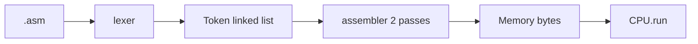

# Notes 08 — Лексер, список токенів, асемблер

Поруч із лабою: [lab-08-give-it-a-language.md](lab-08-give-it-a-language.md).

Лаба — **що здати** (лексер, asm, три програми, `v1.0.0`). Цей файл — **з чим розібратись**. Лексер і програми — `./build/ember lex …` та `./build/ember programs/fib.asm`. Дрібні C++-досліди — `scratch.cpp` як у [Notes 01](lab-01-a-box-of-bytes.notes.md).

| | Зроби зараз | Зупинись, коли |
|---|---|---|
| **§1** | ручний розбір `ADD A, B` | таблиця токенів |
| **§2** | `0xGG` | помилка з номером рядка |
| **§3** | три вузли списка | walk з `next` |
| **§4** | два проходи, `JMP done` | адреса `done` відома на другому |

**Лексема** — шматок тексту (`LOADI`, `65`, `,`). **Токен** — лексема + вид + рядок. **Курсор** — індекс у вихідному рядку. **Два проходи** — спочатку зібрати мітки, потім виставити байти.

Мнемоніки й **розміри інструкцій** — [ISA.md §5](ISA.md#5-the-instruction-set), той
самий файл, з якого їх читає `step()`. Розійдуться на один байт — асемблер видасть
програму, яка запуститься й тихо робитиме щось інше.

---

## Ідея

Байти `0x10` чесні й нечитабельні. Текст:

```txt
LOADI A, 65
OUT
HALT
```

Сканер **не** виконує. Він каже, *що це*. Нелегальний символ, обірваний `0x` — помилка. Тепер мова не лише «розпізнати рядок» — вона запускає комп’ютер, який ти вісім тижнів збирав.

І тут окупається Lab 7. Там ти зупинився на факторіалі, бо рекурсивний `fib` у hex —
це сорок адрес переходів руками. З асемблером `fib` — двадцять читабельних рядків,
а мітки рахує машина. Це і є аргумент на захисті: мова не прикраса, вона робить
наступну програму **дешевою**.



---

## 1. Розбір руками

Рядок `ADD A, B\n`.

| kind | text |
|---|---|
| Ident | `ADD` |
| Ident | `A` |
| Comma | `,` |
| Ident | `B` |
| Newline | `\n` |

Пробіли з’їдає лексер, у список не кладе. `; comment` — до кінця рядка, теж не токен (або токен Comment, якщо хочеш — не треба).

Алгоритм курсора: peek, якщо літера → `ident()` їсть, поки літера/цифра/`_`; якщо цифра або `0x`/`0b` → `number()`; якщо `,` або `:` → пунктуація; інакше error.

### Спробуй

Напиши на папері токени для `loop: JMP loop`. Потім прожени через `lex` (M1) і звір.

**Очікуй:** `Ident(loop) Colon Ident(JMP) Ident(loop) Newline Eof`.

---

## 2. Коли лексер каже ні

`LOADI A, 0xGG` — після `0x` символи мають бути hex. `G` — ні.

### Спробуй

Поклади `LOADI A, 0xGG` у `bad.asm` і:

```bash
./build/ember lex bad.asm
```

**Очікуй:** щось на кшталт `line 1: bad number`. Не «тихо взяли 0». Не падіння без рядка.

Ще обов’язкові відмови: `@` (якщо немає в граматиці), рядок без `\n` у кінці — ок, але раптовий байт `0x01` у текстовому файлі — error.

Друга половина лаби — *повідомити про помилку*.

---

## 3. Список, бо довжина невідома

```cpp
struct Token {
    enum class Kind { Ident, Number, Comma, Colon, Newline, Eof };
    Kind kind;
    std::string text;
    int line;
    Token* next = nullptr;
};
```

Порожній: `head = tail = nullptr`. `append`: `new Token{...}`; якщо порожньо — обидва на новий; інакше `tail->next = t; tail = t`. Обхід: `for (Token* t = head; t; t = t->next)`. Звільнення: поки `head` — запам’ятай `next`, `delete head`, просунь.

### Спробуй

```cpp
#include <iostream>
#include <string>
struct Token {
    std::string text;
    Token* next = nullptr;
};
void append(Token*& head, Token*& tail, const std::string& t) {
    auto* n = new Token{t, nullptr};
    if (!head) head = tail = n;
    else { tail->next = n; tail = n; }
}
void destroy(Token* head) {
    while (head) { Token* n = head->next; delete head; head = n; }
}
int main() {
    Token *head = nullptr, *tail = nullptr;
    append(head, tail, "ADD");
    append(head, tail, "A");
    append(head, tail, "B");
    for (Token* p = head; p; p = p->next) std::cout << p->text << '\n';
    destroy(head);
}
```

**Очікуй:** три рядки `ADD` / `A` / `B`. Збери з ASan. Прибери `destroy` — на Linux з `ASAN_OPTIONS=detect_leaks=1` буде leak report.

Масив на 1024 токени теж працює, якщо є стеля й повідомлення «too many tokens». Лаба просить список як ADT — зроби інтерфейс `push_back` / `walk` / `destroy`, навіть якщо всередині масив (тоді в README: чому). Чесніший шлях — вузли.

---

## 4. Два проходи

```txt
       JMP done    ; ще не знаємо адресу
       NOP
done:  HALT
```

Pass 1: `done` → адреса `HALT` (розмір `JMP` + розмір `NOP`). Pass 2: закодувати `JMP` з цією адресою.

Один прохід уперед ламається, коли мітка **нижче**. Назад можна було б — не ускладнюй, завжди два проходи.

Розмір інструкції бери з [ISA.md](ISA.md) — з того самого місця, що й `step()`.
Найкраще — спільна константа в коді, щоб розійтись було нічим. Якщо асемблер і CPU
все ж розійшлись, правий той, хто збігається з таблицею.

---

## Програми

| Файл | Доводить | |
|---|---|---|
| `hello.asm` | `OUT` / `OUTS` | обов'язково |
| `search.asm` | цикл Lab 4 читається людьми | обов'язково |
| `fib.asm` | рекурсія на `CALL`/`RET` з Lab 7; `fib(6)` = `8` | обов'язково |
| `bounce.asm` | `PLOT` Lab 5 | Advanced |

`search.asm` поклади в README поруч із hex, який набивав у Lab 4. Цей діф — і є
відповідь на питання «навіщо мова».

CLI: `./ember programs/fib.asm` збирає й виконує. REPL з Lab 1 лишається для дебагу байтів.

---

## У проєкті `ember`

| Ідея | Де |
|---|---|
| курсор, `ident`/`number` | `src/asm/lexer.cpp` |
| вузли | `token.hpp` |
| мітки | `assembler.cpp` pass 1 |
| розміри інструкцій | [ISA.md](ISA.md) — спільна константа зі `step()` |
| байти | pass 2 → `Memory` |

Якщо `fib` поводиться дивно — майже завжди конвенція: щось затерло `B` або `H`
через `CALL`. Додай команду `stack` і покроково подивись.

README — головний продукт лаби: діаграма (текст → токени → байти → CPU → екран),
[карта пам'яті](ISA.md#2-memory-map), реалізовані інструкції плюс свої розширення в
тому ж форматі, конвенція виклику, три команди збірки, вставлений вивід `fib` і кадр
`show`. Ліміти пиши чесно: один рядок — одна інструкція, без `2+3` в операнді
(Stretch — дерево).

---

## На захисті

- Що таке токен? Чому CPU не читає `.asm` напряму?
- Простеж курсор у `LOADI A, 0x41`.
- Два рядки, які лексер **мусить** відшити.
- Навіщо список (або навіщо стеля масиву)? Інтерфейс ADT.
- Навіщо два проходи?
- Чим розбір `.asm` схожий на розбір будь-якого формату з літерами й числами, і чим ні?

Остання відповідь: схожий — треба розпізнати ланцюжок за правилами. Інший — ці правила запускають комп’ютер, який ти вісім тижнів будував.

---

## Якщо мало часу

§1 на папері, §2 на файлі з `0xGG`, `hello.asm` до `HALT`. `search` і `fib` — до
показу. `bounce` — тільки якщо лишився тиждень.
