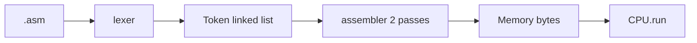

# Notes 08 — Лексер, список токенів, асемблер

Поруч із лабою: [lab-08-give-it-a-language.md](lab-08-give-it-a-language.md).

Лаба — **що здати** (лексер, asm, чотири програми, `v1.0.0`). Цей файл — **РГР, яку хочеться писати**: розпізнати ланцюжок *своєї* мови або сказати, де він зламаний.

| | Зроби зараз | Зупинись, коли |
|---|---|---|
| **§1** | ручний розбір `ADD A, B` | таблиця токенів |
| **§2** | `0xGG` | помилка з номером рядка |
| **§3** | три вузли списка | walk з `next` |
| **§4** | два проходи, `JMP done` | адреса `done` відома на другому |

**Лексема** — шматок тексту (`LOADI`, `65`, `,`). **Токен** — лексема + вид + рядок. **Курсор** — індекс у вихідному рядку. **Два проходи** — спочатку зібрати мітки, потім виставити байти.

---

## Ідея

Байти `0x10` чесні й нечитабельні. Текст:

```txt
LOADI A, 65
OUT
HALT
```

Сканер **не** виконує. Він каже, *що це*. Нелегальний символ, обірваний `0x` — помилка. Це той самий навик, що «`$` + hex + `:`», але мова щось *робить*.



---

## 1. Розбір руками

Рядок `ADD A, B\n`.

| kind | text |
|---|---|
| Ident | `ADD` |
| Ident | `A` |
| Comma | `,` |
| Ident | `B` |
| Newline | `\n` |

Пробіли з’їдає лексер, у список не кладе. `; comment` — до кінця рядка, теж не токен (або токен Comment, якщо хочеш — не треба).

Алгоритм курсора: peek, якщо літера → `ident()` їсть, поки літера/цифра/`_`; якщо цифра або `0x`/`0b` → `number()`; якщо `,` або `:` → пунктуація; інакше error.

### Спробуй

Напиши на папері токени для `loop: JMP loop`. Потім прожени через `lex` (M1) і звір.

**Очікуй:** `Ident(loop) Colon Ident(JMP) Ident(loop) Newline Eof`.

---

## 2. Мова відкидає

`LOADI A, 0xGG` — після `0x` символи мають бути hex. `G` — ні.

### Спробуй

Поклади в файл і виклич лексер.

**Очікуй:** щось на кшталт `line 1: bad number`. Не «тихо взяли 0». Не падіння без рядка.

Ще обов’язкові відмови: `@` (якщо немає в граматиці), рядок без `\n` у кінці — ок, але раптовий байт `0x01` у текстовому файлі — error.

Це друга половина РГР: *повідомити про помилку*.

---

## 3. Список, бо довжина невідома

```cpp
struct Token {
    enum class Kind { Ident, Number, Comma, Colon, Newline, Eof };
    Kind kind;
    std::string text;
    int line;
    Token* next = nullptr;
};
```

Порожній: `head = tail = nullptr`. `append`: `new Token{...}`; якщо порожньо — обидва на новий; інакше `tail->next = t; tail = t`. Обхід: `for (Token* t = head; t; t = t->next)`. Звільнення: поки `head` — запам’ятай `next`, `delete head`, просунь.

### Спробуй

Три `append` у циклі, надрукуй `text`. Без `delete` — LSan. З `delete` — чисто.

Масив на 1024 токени теж працює, якщо є стеля й повідомлення «too many tokens». Лаба просить список як ADT — зробіть інтерфейс `push_back` / `walk` / `destroy`, навіть якщо всередині масив (тоді в README: чому). Чесніший шлях — вузли.

---

## 4. Два проходи

```txt
       JMP done    ; ще не знаємо адресу
       NOP
done:  HALT
```

Pass 1: `done` → адреса `HALT` (розмір `JMP` + розмір `NOP`). Pass 2: закодувати `JMP` з цією адресою.

Один прохід уперед ламається, коли мітка **нижче**. Назад можна було б — не ускладнюй, завжди два проходи.

Розмір інструкції бери з тієї ж таблиці, що `step`. Якщо лексер і CPU розходяться — винен лексер.

---

## Чотири програми

| Файл | Доводить |
|---|---|
| `hello.asm` | `OUT` / `OUTS` |
| `search.asm` | цикл Lab 4 читається людьми |
| `fib.asm` | `CALL`/`RET` Lab 7 |
| `bounce.asm` | `PLOT` Lab 5–6 |

CLI: `./ember programs/fib.asm` збирає й виконує. REPL з Lab 1 лишається для дебагу байтів.

---

## У проєкті `ember`

| Ідея | Де |
|---|---|
| курсор, `ident`/`number` | `src/asm/lexer.cpp` |
| вузли | `token.hpp` |
| мітки | `assembler.cpp` pass 1 |
| байти | pass 2 → `Memory` |

README: діаграма, таблиця опкодів, три команди збірки, скрін `fib` і `bounce`. Ліміти: один рядок — одна інструкція, без `2+3` у операнді (Stretch — дерево).

---

## На захисті

- Що таке токен? Чому CPU не читає `.asm` напряму?
- Простеж курсор у `LOADI A, 0x41`.
- Два рядки, які лексер **мусить** відшити.
- Навіщо список (або навіщо стеля масиву)? Інтерфейс ADT.
- Навіщо два проходи?
- Чим це та сама задача, що `$hex:$hex`, і чим ні?

Остання відповідь: та сама — розпізнати ланцюжок граматики. Інша — граматика запускає комп’ютер, який ти вісім тижнів будував.

---

## Якщо мало часу

§1 на папері, §2 на файлі з `0xGG`, `hello.asm` до `HALT`. Решту програм — до показу.
