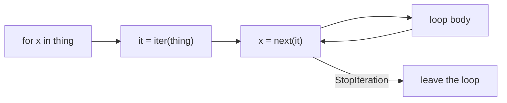

# Notes 01 — Ітератори, генератори, корпус

Поруч із лабою: [lab-01-iterators-and-the-corpus.md](lab-01-iterators-and-the-corpus.md).

Лаба — **що здати** (потік документів, токени, таблиця пам’яті, тег). Цей файл — **з чим розібратись**: коротка теорія і досліди. Підходить і на парі (шариш REPL), і вдома.

Досліди нижче — ті самі задачі, що на Python-співбесіді (протокол `for`, `yield`, лінивість). Це не окремий «курс до інтерв’ю»: пояснив вивід уголос — ти вже відповідаєш.

Як проходити: термінал → `python` (або `uv run python`). Перед запуском скажи вголос, що очікуєш. Потім звіряй.

Лаба розбита на кроки **M1–M4** (milestone — етап здачі, не «модуль коду»):

| | Що зробити | Як перевірити очима |
|---|---|---|
| **M1** | лінивий `iter_documents` | `next(...)` повертається миттєво навіть на великому корпусі |
| **M2** | стрімінговий `tokenize` | NFC + `casefold`; тести на кирилицю й `café` |
| **M3** | пайплайн статистики + `tracemalloc` | `python -m findex.stats data/` друкує числа й пік RAM |
| **M4** | таблиця eager vs lazy | у README дві версії на тому самому зрізі |

**Корпус** — набір текстів, які індексуєш (нотатки, Gutenberg, Вікіпедія). **Токен** — одиниця індексу, зазвичай слово. **NFC** — форма Unicode, де `é` це один кодпойнт, а не `e` + наголос. **`casefold()`** — агресивніше за `lower()`: зроблено саме для порівняння без регістру. **`tracemalloc`** — стандартна бібліотека: «скільки байтів виділив *мій* Python-код» (пік — те, що пишеш у README).

---

## Ідея

`for x in thing` **не** ходить індексами `0, 1, 2`. Python бере ітератор і крутить `next`, поки не вилетить `StopIteration`.

- **Iterable** — має `__iter__()`, щоразу *новий* ітератор (список, рядок, файл можна відкрити знову).
- **Iterator** — має `__next__()` і *стан*: де він зараз. Вичерпався — назавжди порожній.

Генератор — ітератор без класу: функція з `yield`. Виклик **нічого не рахує** — лише повертає об’єкт. Тіло біжить до наступного `yield`, коли хтось попросить `next`.

У пошуковику це видно одразу: корпус на гігабайт не вміщується в список. Потік «файл → токени → лічильник» тримає в RAM *один документ плюс таблицю слів*.



Лінивий пайплайн — кожна стадія тягне *один* елемент з попередньої. Матеріалізується лише стік (у нас `Counter`).


Квадратні дужки `[...]` — одразу весь список. Дужки `(...)` — генераторний вираз: нічого, поки не підеш циклом.

---

## 1. Вичерпаний ітератор

```python
it = iter([1, 2, 3])
print(next(it), next(it), next(it))
try:
    print(next(it))
except StopIteration:
    print("empty")
print("second pass:", list(it))
```

**Очікуй:** `1 2 3`, потім `empty`, потім `second pass: []`. Четвертий `next` піднімає `StopIteration`. `for` його ковтає — тому другий прохід мовчить.

Список можна крутити двічі: кожен `for` бере *свіжий* `iter(list)`. Сам ітератор — це позиція.

**Навіщо в проєкті:** порахував документи `sum(1 for _ in docs)`, потім «токенізую той самий `docs`» — другий цикл порожній. Або виклич функцію ще раз, або зроби список (і тоді прощавай стала пам’ять).

---

## 2. Список vs генераторний вираз

```python
import tracemalloc

def peak(fn):
    tracemalloc.start()
    fn()
    _, p = tracemalloc.get_traced_memory()
    tracemalloc.stop()
    return p

eager = peak(lambda: sum([x * x for x in range(10**7)]))
lazy  = peak(lambda: sum(x * x for x in range(10**7)))
print(eager, lazy, round(eager / lazy, 1))
```

**Очікуй:** eager на порядки більший (сотні МБ проти одиниць). Список тримає всі квадрати одночасно; генератор — лише поточне `x`.

`sum`, `Counter`, `any` вміють їсти ітератор. `sorted`, `list`, `set`, `"".join` — з’їдають увесь потік у пам’ять.

---

## 3. Коли тіло генератора взагалі біжить

```python
g = (print("run", i) or i for i in range(3))
print("created")
print("got", next(g))
```

**Очікуй:** спочатку лише `created`. `run 0` з’являється на `next`. Створення генератора — не робота.

Так само `def f(): print("hi"); yield 1` — `f()` мовчить; `next(f())` друкує `hi`. Помилка всередині генератора вилізе *далеко* від рядка, де його створили.

---

## 4. Той самий «café», різні байти

```python
import unicodedata
a = "café"
b = "cafe\u0301"
print(a, b)
print("raw equal:", a == b)
print("NFC equal:", unicodedata.normalize("NFC", a) == unicodedata.normalize("NFC", b))
print([hex(ord(c)) for c in a])
print([hex(ord(c)) for c in b])
```

**Очікуй:** на екрані обидва виглядають як café; без NFC `False`; після NFC `True`. У `b` два кодпойнти: `e` + combining acute.

Без нормалізації половина запитів «café» не знайде документ, набраний інакше. У `tokenize` спочатку NFC, потім `casefold`, потім `re.finditer` (не `findall` — той будує список усіх збігів).

---

## 5. Файл — це ітератор рядків

```python
from pathlib import Path
p = Path("/tmp/findex-lab01.txt")
p.write_text("one\ntwo\n", encoding="utf-8")
f = p.open(encoding="utf-8")
print("first:", list(f))
print("second:", list(f))
f.close()
```

**Очікуй:** `first: ['one\n', 'two\n']`, `second: []`. Відкритий файл *є* ітератором. Другий прохід — як §1.

Завжди `encoding="utf-8"`. Дефолт залежить від ОС (Windows сюрприз). `f.read()` / `readlines()` — увесь файл у RAM; для корпусу це баг.

---

## У проєкті `findex`

Коли M1–M3 зроблені, ідеї з notes лежать у файлах так:

| Ідея | Де дивитись |
|---|---|
| лінивий обхід дерева / jsonl | `src/findex/corpus.py` → `iter_documents` |
| NFC, `casefold`, `finditer` | `src/findex/tokenize.py` |
| пайплайн + `--limit` через `islice` | `src/findex/stats.py` |
| пік RAM | `tracemalloc` у `stats` |

**M1 зроблено**, якщо `next(iter_documents(Path("data")))` не читає весь корпус. **M4** — навмисно написати жадібну версію, заміряти, таблицю в README, код знову лінивий.

Корпус у `data/`, і `data/` у `.gitignore`. У git лише код.

---

## На співбесіді

- Що робить `for` насправді. Чим iterable відрізняється від iterator.
- Чому генератор однопрохідний. Як пройти двічі.
- Квадратні дужки vs круглі в comprehension.
- Навіщо `encoding=` і NFC.
- Де в пайплайні легітимно рости пам’яті (стіки на кшталт `Counter`), а де — ні.

Дослід §1 на папері без підглядання ≈ перше питання.

---

## Якщо мало часу

Три запуски: §1, §2, §4. Потім `python -m findex.stats data/ --limit 100` і глянь пік пам’яті. Решту — з лаби, секція Theory.
