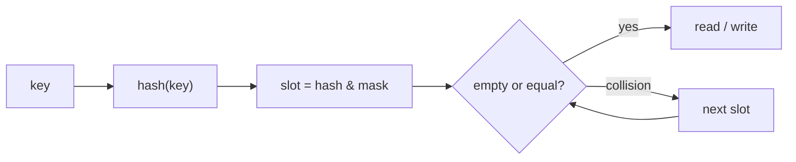
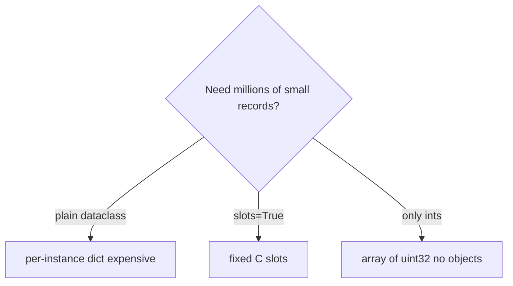

# Notes 02 — Словники, хеш, інвертований індекс

Поруч із лабою: [lab-02-data-structures-and-the-inverted-index.md](lab-02-data-structures-and-the-inverted-index.md).

REPL або `uv run python`. Перед кожним запуском — прогноз. Досліди з `__hash__` / `__eq__` і `__slots__` — класика співбесіди, не «внутрішності заради внутрішностей».

Етапи здачі (**M1–M4**):

| | Що зробити | Як перевірити |
|---|---|---|
| **M1** | індекс у пам’яті | термін → відсортовані постінги; корпус усе ще стрім |
| **M2** | Boolean AND/OR/NOT через merge | `--engine merge` і `set`; цифри на частих і рідких термінах |
| **M3** | pickle + другий формат | save/load; розмір і час у таблиці |
| **M4** | три рядки про пам’ять | dataclass / slots / `array('I')` у README |

**Інвертований індекс** — словник «слово → документи, де воно є» (навпаки до «документ → слова»). **Posting** — запис про одне входження терміна в документ (`doc_id`, скільки разів, інколи позиції). **Open addressing** — колізія хешу: шукаємо *інший слот у тій самій таблиці*, не ланцюжок. **`__slots__`** — замість `__dict__` на кожному об’єкті фіксовані поля в C; менше байтів, не можна додати випадковий атрибут. **`pickle`** — серіалізація графа об’єктів Python; `load` з чужого файлу може **виконати код**.

---

## Ідея

`dict` — хеш-таблиця: `hash(key)` каже, в який слот дивитись. Середній пошук O(1). Два ключі можуть дати той самий слот — **колізія**; CPython пробує наступні слоти. Коли таблиця заповнена приблизно на 2/3 — **resize** (перебудова). З 3.7 порядок ключів — порядок вставки.

Контракт: якщо `a == b`, то `hash(a) == hash(b)`. Порушив — ключі «зникають». Мутабельні типи (`list`, `dict`, `set`) тому не хешуються.

У пошуковику індекс *і є* словник термінів. Мільйон об’єктів `Posting` з `__dict__` — сотні МБ накладних витрат; slots і `array` це ріжуть.





---

## 1. Resize словника

```python
import sys
d = {}
for n in range(25):
    d[n] = n
    if n in {0, 4, 5, 10, 11, 21, 22}:
        print(n + 1, "keys →", sys.getsizeof(d), "bytes")
```

**Очікуй:** розмір стрибає не на кожній вставці, а пачками (часто близько 5–6, 10–11, 21–22 ключів). Це ріст таблиці, не «баг getsizeof».

Вставка *амортизовано* O(1): більшість дешеві, інколи дорогий rebuild.

---

## 2. `__eq__` без `__hash__`, потім поганий хеш

```python
class Item:
    def __init__(self, x):
        self.x = x
    def __eq__(self, other):
        return isinstance(other, Item) and self.x == other.x

try:
    {Item(1)}
except TypeError as e:
    print(type(e).__name__, e)

class Bad(Item):
    def __hash__(self):
        return 42

s = {Bad(i) for i in range(3)}
print("in set:", Bad(1) in s)
```

**Очікуй:** спочатку `TypeError: unhashable type: 'Item'` — Python ставить `__hash__ = None`, щойно є `__eq__`. З константою `42` у set покласти можна: усі ключі в одному слоті, `in` деградує до лінійного пошуку.

Правильно: хешувати ті самі поля, що й у `__eq__`. Найпростіше — `@dataclass(frozen=True)`.

---

## 3. `PYTHONHASHSEED`

```bash
python -c 'print(hash("hello"))'
python -c 'print(hash("hello"))'
PYTHONHASHSEED=0 python -c 'print(hash("hello"))'
PYTHONHASHSEED=0 python -c 'print(hash("hello"))'
```

**Очікуй:** два перші запуски часто *різні* (рандомізація проти hash-flooding). З `PYTHONHASHSEED=0` — однаковий хеш між процесами.

Не зберігай «сирий» `hash(term)` на диск. Порядок `set` між запусками теж не стабільний.

---

## 4. Slots vs `__dict__`

```python
from dataclasses import dataclass
import tracemalloc

@dataclass
class Fat:
    a: int
    b: int
    c: int

@dataclass(slots=True)
class Thin:
    a: int
    b: int
    c: int

def peak(cls, n=1_000_000):
    tracemalloc.start()
    xs = [cls(1, 2, 3) for _ in range(n)]
    _, p = tracemalloc.get_traced_memory()
    tracemalloc.stop()
    return p, xs[0]

print("fat", peak(Fat)[0])
print("thin", peak(Thin)[0])
```

**Очікуй:** slots помітно менший (часто ~2–3×). `sys.getsizeof` одного інстанса — *мілка* оцінка: не рахує об’єкти, на які посилаються поля. Для README — `tracemalloc` на мільйоні, як тут.

---

## 5. `array` vs `list` цілих

```python
import sys
from array import array

n = 10**6
lst = list(range(n))
arr = array("I", range(n))
print("list getsizeof", sys.getsizeof(lst))
print("array getsizeof", sys.getsizeof(arr))
```

**Очікуй:** `array` у рази менший. `getsizeof(list)` ще й **занижує**: це лише масив *покажчиків*. Кожен `int` — окремий об’єкт (~28 байт). Реальна вартість списку ≈ покажчики + мільйон інтів.

Постінги як пари `array('I')` (doc_id, tf) — відповідь на «чому індекс 3 ГБ». Lab 8 оберне це в NumPy без копії (`np.frombuffer`).

---

## У проєкті

`defaultdict(list)` + flush `Counter` документа → відсортовані постінги. Merge двох відсортованих списків — два вказівники, не `set`, коли списки довгі. `pickle` — ок для *свого* файлу; у коментарі напиши, чому не для мережі.

---

## На співбесіді

- Що таке колізія і навіщо resize.
- Контракт hash/eq. Чому list не може бути ключем.
- Навіщо `frozen=True` і `slots=True`.
- Чому `getsizeof(list_of_ints)` бреше.
- Чим pickle небезпечний.
