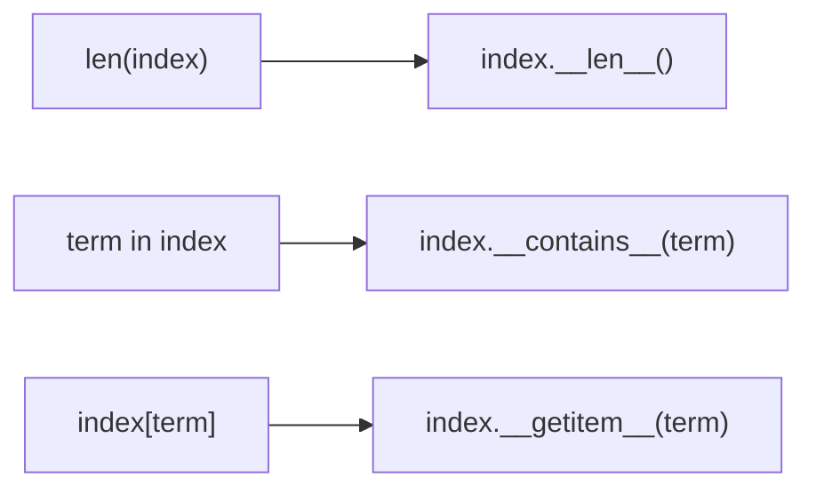
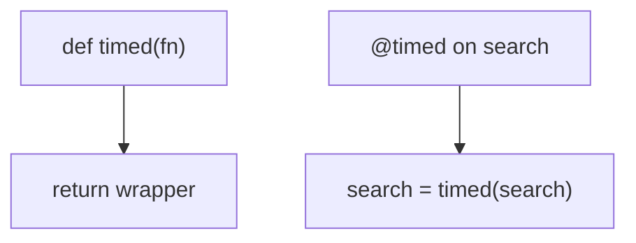

# Notes 03 — Data model, декоратори, рейтинг

Поруч із лабою: [lab-03-the-object-model-and-ranking.md](lab-03-the-object-model-and-ranking.md).

REPL. `len`, `in`, `with`, `@` — не магія: інтерпретатор викликає dunder-методи. На співбесіді просять намалювати цей виклик і пояснити BM25 одним абзацом.

Етапи здачі (**M1–M4**):

| | Що зробити | Як перевірити |
|---|---|---|
| **M1** | `Index` як об’єкт | `len(index)`, `"python" in index`, `with open_index` |
| **M2** | `Scorer`: TF-IDF і BM25 | рідке слово вище; 20-те повторення майже нічого; короткий документ вище довгого |
| **M3** | парсер запиту | дерево, не рядок: `parse("a OR b") == Or(...)` |
| **M4** | `@timed`, `lru_cache`, снипети, P@5 | лог часу; повторний запит швидший; таблиця в README |

**Dunder** — метод `__len__`, `__eq__` тощо; built-in лише тонкий обгортка. **Протокол** — «поводиться як»: є `__iter__` → ітерований, без спільного предка. **Descriptor** — об’єкт із `__get__`; так працює `@property`. **TF-IDF** — вага = частота в документі × рідкість у корпусі. **BM25** — TF-IDF з насиченням TF (`k1`) і штрафом довгих документів (`b`). **precision@5** — скільки з топ-5 результатів ти вважаєш правильними, поділити на 5.

---

## Ідея

`len(x)` → `x.__len__()`. `x in y` → `y.__contains__(x)`. `@timed` над `def search` — це `search = timed(search)`. Навчив клас цим методам — він *є* контейнером, контекстом, функцією.

Рейтинг: Boolean дає множину; користувач хоче список. Кожен термін запиту додає вагу в `score[doc_id]`; топ-k через `heapq.nlargest`, не повне сортування.





---

## 1. `__len__` і `bool`

```python
class V:
    pass

try:
    len(V())
except TypeError as e:
    print(e)

class W:
    def __len__(self):
        return 3

w = W()
print(len(w), bool(w))

class Empty:
    def __len__(self):
        return 0

print(bool(Empty()))
```

**Очікуй:** без `__len__` — `TypeError`. З `__len__ → 3` і `len`, і `bool` істинні. `len == 0` → `bool` хибний, якщо немає `__bool__`.

`if results:` працює, щойно є `__len__` або `__bool__`.

У нормальному коді пиши `len(x)`, не `x.__len__()`: built-in має швидкі шляхи для C-типів.

---

## 2. `@timed` без `wraps`

```python
import functools, time

def timed_raw(fn):
    def wrapper(*a, **k):
        t0 = time.perf_counter()
        try:
            return fn(*a, **k)
        finally:
            print("ms", (time.perf_counter() - t0) * 1000)
    return wrapper

def timed(fn):
    @functools.wraps(fn)
    def wrapper(*a, **k):
        return fn(*a, **k)
    return wrapper

@timed_raw
def search_raw():
    """Find documents."""
    pass

@timed
def search():
    """Find documents."""
    pass

print(search_raw.__name__, search_raw.__doc__)
print(search.__name__, search.__doc__)
```

**Очікуй:** без `wraps` ім’я `"wrapper"`, докстрінг зник. З `wraps` — `search` і рядок документації.

Тести, логи й `help()` дивляться на `__name__`. Один рядок `wraps` — обов’язковий, не естетика.

---

## 3. `len(x)` vs `x.__len__()` у bytecode

```python
import dis
x = [1, 2, 3]
dis.dis(lambda: len(x))
print("---")
dis.dis(lambda: x.__len__())
```

**Очікуй:** `len(x)` — опкод на кшталт `CALL` до built-in `len` (для list це C, без виклику Python-методу). `x.__len__()` — пошук атрибута + виклик. На списках і рядках перший швидший.

Тому «не викликай dunder вручну» — не етикет, а швидкість і перевірки типів.

---

## 4. `lru_cache` і список

```python
import functools

@functools.lru_cache(maxsize=32)
def score(tokens):
    return sum(map(ord, tokens))

try:
    score(["a", "b"])
except TypeError as e:
    print(e)

print(score(("a", "b")))
print(score(("a", "b")))
print(score.cache_info())
```

**Очікуй:** список — `unhashable type: 'list'`. Кортеж працює; другий виклик — hit у `cache_info()`.

Кеш ключує аргументи хешем. Запит у рядок / frozenset термінів — ок; сирий `list` позицій — ні.

---

## 5. `contextmanager`: `return` і виняток

```python
from contextlib import contextmanager

@contextmanager
def cm():
    print("enter")
    try:
        yield "ix"
    finally:
        print("exit")

def returning():
    with cm() as x:
        print("body", x)
        return 1

print("got", returning())

try:
    with cm():
        raise RuntimeError("boom")
except RuntimeError:
    print("caught")
```

**Очікуй:** `enter` / `body` / `exit` / `got 1` — `return` з `with` **не** пропускає `__exit__`. Після `raise` теж буде `exit`, потім `caught`.

Це і є сенс `with`: прибрати ресурс завжди. `open_index` так закриває mmap/файл.

---

## У проєкті

`Index` говорить протоколами контейнера. `TfIdf` і `BM25` — два об’єкти з `__call__` (або функції); `typing.Protocol` оформиш у Lab 4. Вузли запиту з `&` / `|` / `~` зручно тестувати як дерева, не як рядки.

---

## На співбесіді

- Що викликає `len` / `in` / `[]`. Навіщо `__repr__` на кожному класі.
- Що таке декоратор одним рядком: `f = dec(f)`. Навіщо `wraps`.
- Duck typing vs ієрархія класів. Навіщо Protocol.
- BM25: що контролюють `k1` і `b`. Що при `b = 0`.
- Чому `with` кращий за голий `try/finally` у публічному API.
