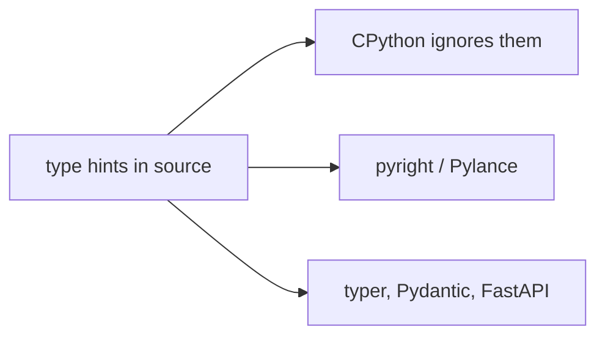
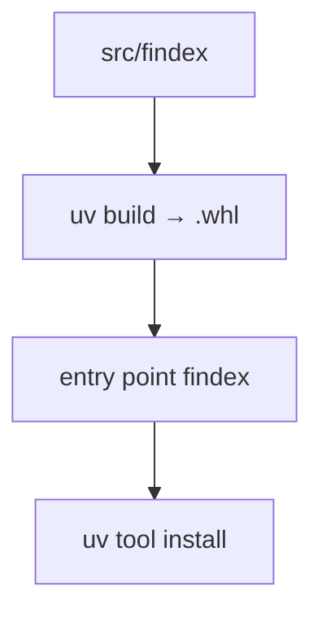

# Notes 04 — Типи, тести, пакунок, CLI

Поруч із лабою: [lab-04-typing-testing-packaging-cli.md](lab-04-typing-testing-packaging-cli.md).

Термінал: `uv run pyright`, `uv run pytest`, `uv build`. На співбесіді «чи ти пишеш скрипти чи софт» часто зводиться саме до цього стеку.

Етапи здачі (**M1–M4**):

| | Що зробити | Як перевірити |
|---|---|---|
| **M1** | pyright **strict**, нуль помилок | `uv run pyright` зелений |
| **M2** | ≥ 30 pytest + ≥ 3 Hypothesis | `pytest --cov`; CLI через `CliRunner` |
| **M3** | `typer` + wheel | `uv tool install .` → `findex --help` |
| **M4** | logging + CI + GitHub Release | бейдж CI; з чистої машини ставиться wheel |

**Type hint** — анотація, яку **інтерпретатор ігнорує**; читають її pyright, IDE, FastAPI, Pydantic, typer. **Narrowing** — після `if x is None: return` перевіряч знає, що далі `x` не `None`. **Hypothesis** — генерує входи й шукає контрприклад, потім стискає його до найменшого. **Wheel** (`.whl`) — zip інстальованого пакета. **Entry point** — рядок у `pyproject.toml`, після якого `findex` з’являється в `PATH`. **`src/` layout** — код у `src/findex/`, тести зовні: pytest імпортує *встановлений* пакет, не випадкову папку.

---

## Ідея

Підказки типів — контракт для інструментів, не для CPython. Тест без `assert` — театр. Пакунок — щоб колега запустив одну команду, а не клонував твій ноутбук.





---

## 1. Інтерпретатор не перевіряє анотації

```python
def n() -> int:
    return "oops"  # type: ignore[return-value]  # прибери ignore і дивись pyright

print(n(), type(n()))
```

Запусти файл: **Очікуй:** надрукує `oops` і `str`. Потім:

```bash
uv run pyright path/to/file.py
```

**Очікуй:** помилка типу повернення. У цьому вся ідея поступової типізації.

---

## 2. Narrowing

```python
def shout(x: str | None) -> str:
    return x.upper()
```

**Очікуй від pyright:** `x` може бути `None`, у `None` немає `upper`.

```python
def shout(x: str | None) -> str:
    if x is None:
        return ""
    return x.upper()
```

**Очікуй:** чисто. Після гілки `None` тип звузився до `str`. Це не runtime-магія — лише перевіряч.

---

## 3. pytest vs голий `assert`

```python
def test_maps():
    assert {"a": 1} == {"a": 2}
```

```bash
uv run pytest test_maps.py -q
```

**Очікуй:** pytest покаже diff ключів/значень. Голий `assert` у скрипті — лише `AssertionError` без пояснення.

Фікстури (`tmp_path`, свій `index`), `@parametrize`, `pytest.raises` — 80% щоденної роботи. Логіку (tokenize, merge, parse) тестуй на маленькому корпусі в `conftest.py`, без мережі й без гігабайт.

---

## 4. Hypothesis на токенізаторі

```python
from hypothesis import given, strategies as st
from findex.tokenize import tokenize

@given(st.text())
def test_no_empty_tokens(s: str):
    for tok in tokenize(s):
        assert tok != ""
```

**Очікуй:** або зелений на сотнях рядків (у т.ч. дивний Unicode), або контрприклад, якого ти не вигадав — порожній рядок після `casefold`, саме пунктуація, сурогати. Властивість важливіша за 20 прикладів з голови.

Інші властивості з лаби: round-trip save/load; merge vs `set`; парсер ідемпотентний на дереві.

---

## 5. Wheel

```bash
uv build
python -c "import zipfile,glob; print(zipfile.ZipFile(glob.glob('dist/*.whl')[0]).namelist()[:15])"
uvx --from dist/findex-*.whl findex --help
```

**Очікуй:** у zip є `findex/...` і метадані; друга команда друкує help **без** твоєї `venv` і без `cd` у репо. Якщо `--help` не з’являється — зламаний entry point, не «uv поганий».

`uv.lock` коміть: це відтворювані версії залежностей.

---

## У проєкті

`logging.getLogger(__name__)` у бібліотеці; конфіг рівня (`-v`/`-vv`) — лише в CLI. Діагностика в stderr, дані (`--json`) у stdout. Очікувані помилки — один рядок і ненульовий код, не traceback.

---

## На співбесіді

- Чому `-> int` не падає в runtime. Хто тоді ловить помилку.
- Що таке narrowing на `X | None`.
- Protocol vs ABC: структурна відповідність без спадкування.
- Навіщо `src/` layout.
- Hypothesis: що таке властивість і shrinking.
