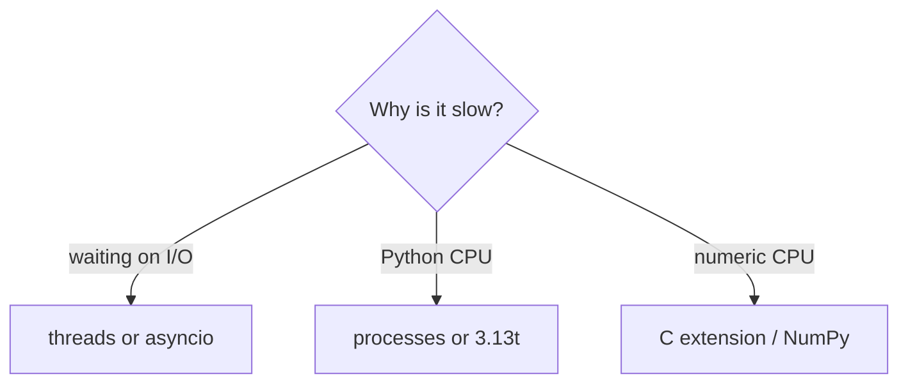
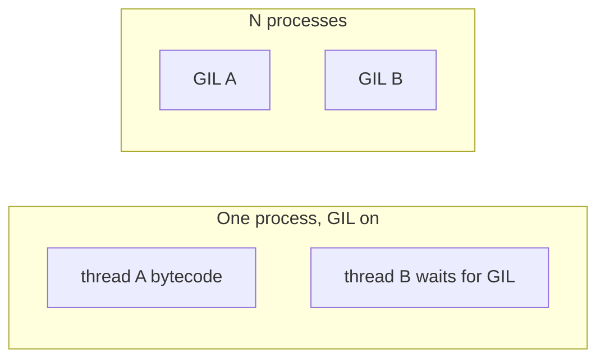

# Notes 05 — Потоки, процеси, GIL

Поруч із лабою: [lab-05-concurrency-and-the-gil.md](lab-05-concurrency-and-the-gil.md).

Термінал. Здогад «потоки прискорять індексацію» майже завжди хибний — спочатку заміряй. На співбесіді GIL питають усі; більшість відповідають «GIL = Python однопотоковий», і це неправда.

Етапи здачі (**M1–M4**):

| | Що зробити | Як перевірити |
|---|---|---|
| **M1** | `build_partial` + `merge` | серійний шлях дає той самий індекс, що Lab 4 |
| **M2** | `--executor serial\|threads\|processes` | один код, три бекенди |
| **M3** | таблиця + графік speedup | wall, CPU, RSS, час merge; PNG у README |
| **M4** | `python3.13t` + сторінка пояснення | `sys._is_gil_enabled()`; гонка, якщо була, задокументована |

**Concurrency** — багато справ *упереміш* (структура). **Parallelism** — багато справ *одночасно* на ядрах. **GIL** (Global Interpreter Lock) — м’ютекс CPython: байткод Python крутить лише один потік за раз. **I/O-bound** — чекаєш диск/мережу; GIL під час `read`/`recv` відпускається. **CPU-bound** — рахуєш токени й хеші; потоки майже не допоможуть. **Pickle** тут — як процеси передають функцію й аргументи через трубу. **Amdahl** — якщо merge 20% часу і він послідовний, більше ніж 5× не витиснеш.

---

## Ідея

Потоки ділять пам’ять і GIL. Процеси — окремий інтерпретатор на воркер: справжній паралелізм, але треба серіалізувати дані. Free-threaded 3.13t (`python3.13t`) прибирає GIL: ті самі потоки раптом масштабуються — і вилазять гонки, які GIL маскував.

Індексація переважно CPU. Мережа Lab 6 — I/O. Два різні інструменти.





---

## 1. CPU: один, два послідовно, два потоки, два процеси

```python
import time
from concurrent.futures import ThreadPoolExecutor, ProcessPoolExecutor

def crunch(n=10**7):
    return sum(i * i for i in range(n))

def crunch_(_):
    return crunch()

def timed(fn):
    t0 = time.perf_counter()
    fn()
    return time.perf_counter() - t0

print("once     ", timed(lambda: crunch()))
print("two serial", timed(lambda: (crunch(), crunch())))
print("two threads", timed(lambda: list(ThreadPoolExecutor(2).map(crunch_, range(2)))))

if __name__ == "__main__":
    print("two procs", timed(lambda: list(ProcessPoolExecutor(2).map(crunch_, range(2)))))
```

**Очікуй:** «два послідовно» ≈ 2× «один». Два потоки ≈ те саме або *повільніше* (боротьба за GIL). Два процеси ≈ близько до «один» за wall-clock, якщо є два ядра (плюс податок на старт і pickle).

Запускай процеси лише з-під `if __name__ == "__main__":` — інакше `spawn` (macOS/Windows) плодить процеси назавжди.

---

## 2. Гонка: `shared += 1`

```python
import threading

shared = 0

def add():
    global shared
    for _ in range(10**6):
        shared += 1

th = [threading.Thread(target=add) for _ in range(2)]
for t in th:
    t.start()
for t in th:
    t.join()
print(shared)
```

**Очікуй:** часто **не** `2_000_000`. `+=` — кілька байткодів: прочитав, додав, записав; GIL може перемкнути посередині.

```python
lock = threading.Lock()
# inside the loop:
with lock:
    shared += 1
```

**Очікуй:** рівно два мільйони, і помітно повільніше. GIL захищає *інтерпретатор*, не твій інваріант.

---

## 3. Інтервал перемикання

```python
import sys
print(sys.getswitchinterval())  # ~0.005 s
sys.setswitchinterval(0.0001)
# re-run the two-threads case from §1
```

**Очікуй:** частіше перемикання → більше накладу на CPU-bound потоки, wall-time гірший. На I/O це менше помітно.

---

## 4. Lambda у процес не їде

```python
from concurrent.futures import ProcessPoolExecutor

def main():
    with ProcessPoolExecutor(2) as pool:
        print(list(pool.map(lambda x: x * x, range(4))))

if __name__ == "__main__":
    main()
```

**Очікуй:** `PicklingError` / не можна pickle `lambda`. Воркер у *іншому* процесі має імпортувати **іменовану** функцію з модуля. `build_partial` — top-level def, не вкладена і не лямбда. Шляхи файлів у воркер, не 200 МБ уже прочитаного тексту.

---

## 5. Free-threaded

```bash
uv python install 3.13t
uv run --python 3.13t python -c "import sys; print(sys._is_gil_enabled())"
```

**Очікуй:** `False` на `3.13t`. Повтори §1 з потоками: wall-time має стати ближчим до процесів. Потім пошукай гонку на спільному `Counter` — без GIL вона вже не «майже завжди ок».

---

## У проєкті

Чанки — *шляхи*, не завантажені документи. Merge послідовний: заміряй окремо, це стеля за Амдалем. Дефолт `--executor processes`, якщо на твоїй машині він виграє. Бонус: I/O-крок (читання файлів / 50 URL) на потоках — щоб у README були *два* бенчмарки й один урок.

---

## На співбесіді

- Concurrency vs parallelism одним реченням.
- Чому потоки не прискорюють чистий Python-CPU і чому прискорюють `time.sleep` / мережу.
- GIL не робить код thread-safe. Приклад `+=`.
- Що pickle-иться між процесами і чому слати шляхи, не гігабайти.
- Що змінює free-threaded build.
