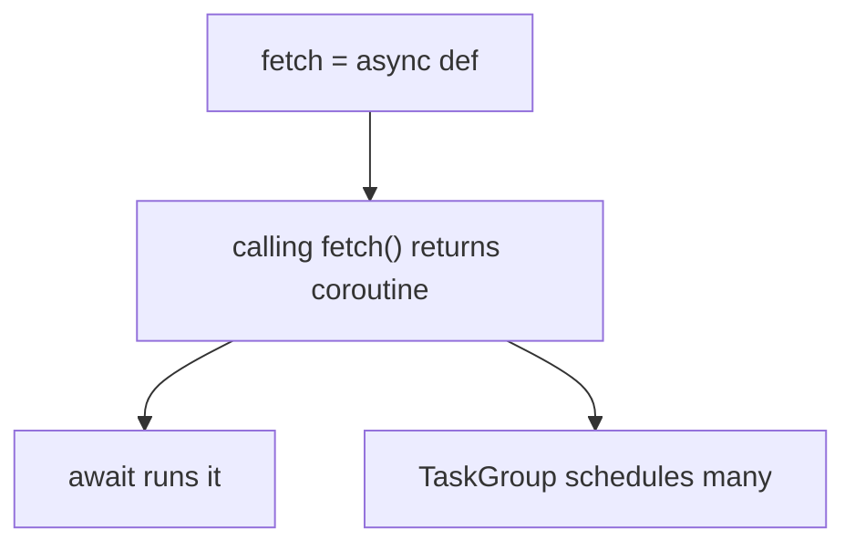

# Notes 06 — `asyncio` і ввічливий краулер

Поруч із лабою: [lab-06-asyncio-crawler.md](lab-06-asyncio-crawler.md).

REPL + маленький скрипт. Це той самий «один потік», що Lab 1 у JS: перемикання в `await`, не витискання ядер. На співбесіді плутають із потоками; різниця — кооперативність і «один `time.sleep` стопорить усіх».

Етапи здачі (**M1–M4**):

| | Що зробити | Як перевірити |
|---|---|---|
| **M1** | ввічливий `fetch` + `robots.txt` | тести на `MockTransport`, без мережі |
| **M2** | черга + `TaskGroup` + ліміти на хост | немає дублікатів; стоп на `max_pages` |
| **M3** | `findex crawl` → jsonl | рядки з’являються під час обходу, не в кінці |
| **M4** | таблиця concurrency 1 / 5 / 20 | pages/s; пояснення, чому не 20 потоків |

**Корутина** — як генератор Lab 1, але `yield` іде планувальнику (event loop), не циклу `for`. Виклик `async def f()` **нічого не запускає** — повертає об’єкт корутини. **Task** — корутина, яку цикл крутить незалежно. **Structured concurrency** (`TaskGroup`) — усі задачі мають батька: помилка скасовує сестер і вилітає нагору. **Semaphore** — лічильник «скільки зараз у секції». **Event loop** — черга готових задач + очікування сокетів через OS (`select`/`kqueue`).

Краулити лише те, що дозволено: свій сайт, документація з відкритим `robots.txt`, локальне дзеркало. Ігнорувати robots — це зловживання, не «оптимізація».

---

## Ідея

Тисячі запитів більшість часу *чекають*. Потік на кожен — важко. Один цикл: дойшов до `await client.get` — віддав керування сусіду. Паралелізму CPU немає; є перекриття очікувань.

Один блокуючий виклик (`time.sleep`, `requests.get`, важкий JSON) заморожує **всі** задачі. Це головний баг asyncio.

```mermaid
sequenceDiagram
  participant Loop as Event loop
  participant A as Task A
  participant B as Task B
  Loop->>A: run until await
  A->>Loop: GET url1 in flight
  Loop->>B: run until await
  B->>Loop: GET url2 in flight
  Note over Loop: OS signals a socket
  Loop->>A: resume with response
```



---

## 1. Виклик `async def` нічого не рахує

```python
import asyncio

async def f():
    print("body")
    return 1

c = f()
print(type(c), c)
print("run", asyncio.run(f()))
# c.close()  # якщо не await-иш створену корутину — закрий, інакше RuntimeWarning
```

**Очікуй:** `c` — coroutine object, `body` ще не друкувалось. `asyncio.run` друкує `body` і `1`. Як `g = gen()` у Lab 1: створення ≠ виконання. Забутий `await` → `RuntimeWarning: coroutine was never awaited`.

---

## 2. Sleep vs `asyncio.sleep`

```python
import asyncio, time

async def nap_async():
    await asyncio.sleep(1)

async def nap_block():
    time.sleep(1)

async def seq():
    t0 = time.perf_counter()
    await nap_async(); await nap_async(); await nap_async()
    print("seq", time.perf_counter() - t0)

async def group_ok():
    t0 = time.perf_counter()
    async with asyncio.TaskGroup() as tg:
        for _ in range(3):
            tg.create_task(nap_async())
    print("group async", time.perf_counter() - t0)

async def group_bad():
    t0 = time.perf_counter()
    async with asyncio.TaskGroup() as tg:
        for _ in range(3):
            tg.create_task(nap_block())
    print("group block", time.perf_counter() - t0)

asyncio.run(seq())
asyncio.run(group_ok())
asyncio.run(group_bad())
```

**Очікуй:** seq ≈ 3 с; group async ≈ 1 с; group block ≈ 3 с. `time.sleep` не `await` — цикл не перемикається.

У краулері токенізація сторінки — CPU. Або пиши сирий текст у jsonl і індексуй *після* обходу, або `run_in_executor`. Не всередині корутини.

---

## 3. Помилка в групі скасовує інших

```python
import asyncio, time

async def boom():
    await asyncio.sleep(0.1)
    raise ValueError("nope")

async def long():
    await asyncio.sleep(10)
    print("should not finish")

async def main():
    t0 = time.perf_counter()
    try:
        async with asyncio.TaskGroup() as tg:
            tg.create_task(boom())
            tg.create_task(long())
    except* ValueError as eg:
        print(type(eg), eg.exceptions)
    print("elapsed", time.perf_counter() - t0)

asyncio.run(main())
```

**Очікуй:** не 10 секунд, а ~0.1 с. Тип — `ExceptionGroup`. `except*` розпаковує вкладені винятки. `CancelledError` — `BaseException`: не ковтай голим `except Exception` навколо `await`.

---

## 4. Один `AsyncClient` на обхід

Новий клієнт на кожен URL відкриває TCP/TLS знову. Один клієнт — пул з’єднань.

```python
import asyncio, time, httpx

URLS = ["https://example.com"] * 10  # для досліду; у лабі — MockTransport

async def many_clients():
    t0 = time.perf_counter()
    async with asyncio.TaskGroup() as tg:
        for u in URLS:
            async def one(url=u):
                async with httpx.AsyncClient() as c:
                    await c.get(url, timeout=10)
            tg.create_task(one())
    return time.perf_counter() - t0

async def one_client():
    t0 = time.perf_counter()
    async with httpx.AsyncClient() as c:
        async with asyncio.TaskGroup() as tg:
            for u in URLS:
                tg.create_task(c.get(u, timeout=10))
    return time.perf_counter() - t0
```

**Очікуй:** спільний клієнт швидший (і менше файлових дескрипторів). У тестах `httpx.MockTransport` — мережі немає.

---

## 5. Debug бачить блокування

```python
import asyncio, time

async def main():
    time.sleep(0.5)
    await asyncio.sleep(0)

asyncio.run(main(), debug=True)
```

**Очікуй:** попередження, що колбек блокував цикл >100 мс. У розробці тримай `PYTHONASYNCIODEBUG=1` або `debug=True`.

---

## У проєкті

Черга URL (frontier) + N воркерів + глобальний і per-host semaphore + пауза між запитами на той самий хост. Вихід — jsonl у міру приходу сторінок, щоб Lab 1 знову їла потік. Індексація поза циклом.

---

## На співбесіді

- Чим корутина відрізняється від потоку (cooperative vs preemptive).
- Що повертає виклик `async def` без `await`.
- Чому `time.sleep` у `async def` — катастрофа.
- Навіщо `TaskGroup` замість «запустив і забув».
- Як обмежити ввічливість: robots, semaphore, delay, `User-Agent`.
