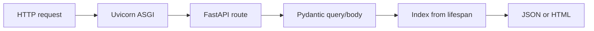
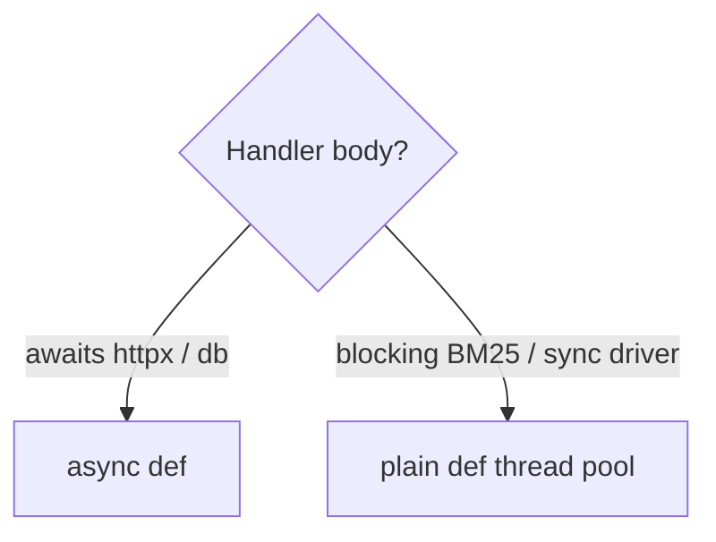

# Notes 07 — FastAPI, Pydantic, деплой

Поруч із лабою: [lab-07-fastapi-web-search.md](lab-07-fastapi-web-search.md).

Термінал, браузер на `/docs`, `curl`. Мета: **URL, з якого шукає чужа людина**, не «у мене uvicorn крутиться». На співбесіді про FastAPI питають `def` vs `async def` і звідки береться 422.

Етапи здачі (**M1–M4**):

| | Що зробити | Як перевірити |
|---|---|---|
| **M1** | API + lifespan | `/docs`, `/health`, валідація `k` |
| **M2** | `TestClient` + вимір `def`/`async def` | 422/404 у тестах; цифри в README |
| **M3** | Jinja UI | форма, підсвічені снипети, сторінка документа |
| **M4** | Docker + публічний URL + `oha` | таблиця p50/p99 local vs deployed |

**ASGI** — контракт «асинхронний веб-додаток ↔ сервер» (Uvicorn). Старий **WSGI** — один синхронний виклик на запит. **Pydantic** — моделі, які *валідують і коерсять* на конструкції; внутрішні dataclass з Lab 2 лишаються всередині. **Lifespan** — `async with` на старт/стоп додатка: індекс вантажиться *раз*. **`Depends`** — викликати функцію перед хендлером і підсунути результат (індекс, settings). **p50 / p99** — медіана і «повільні 1%» латентності. **`oha`** — HTTP load test з CLI.

---

## Ідея

FastAPI читає type hints Lab 4: `k: int` відкидає `?k=abc` з **422** і JSON, ти валідацію не пишеш. OpenAPI на `/docs` малюється з тих самих анотацій.

Хендлер, який **чекає** async-бібліотеки — `async def`. Хендлер, який крутить **блокуючий** BM25 — звичайний `def` (FastAPI кине в thread pool) або `async def` + `asyncio.to_thread`. `async def` + `time.sleep` / синхронний індекс — баг Lab 6 в новій одежі.





---

## 1. 422 і `/docs`

Мінімальний додаток (окремий файл на пару):

```python
from fastapi import FastAPI, Query

app = FastAPI()

@app.get("/search")
def search(k: int = Query(10, ge=1, le=100)):
    return {"k": k}
```

```bash
uv run uvicorn module:app --port 8000
curl -s "http://127.0.0.1:8000/search?k=abc"
```

**Очікуй:** статус 422 і тіло з `detail` (помилка валідації), не твій traceback. Відкрий `/docs` — сторінку згенерував OpenAPI зі сигнатури. Це артефакт портфоліо, не «документація потім».

---

## 2. Коерсія Pydantic

```python
from pydantic import BaseModel, ValidationError

class SearchResult(BaseModel):
    doc_id: int
    score: float

r = SearchResult(doc_id="12", score="0.9")
print(r.doc_id, type(r.doc_id), r.score, type(r.score))
try:
    SearchResult(doc_id="twelve", score=0.9)
except ValidationError as e:
    print(e.error_count(), e.errors()[0]["type"])
```

**Очікуй:** `"12"` → `int` 12, `"0.9"` → `float`. `"twelve"` — `ValidationError`, не тихе `None`. Недовірені дані (запит, `.env`, JSON) → Pydantic; ядро індексу → свої dataclass.

---

## 3. `sleep` у `async def` vs `def`

Два маршрути з `time.sleep(2)`. Бий з двох терміналів одночасно (`curl` / браузер).

**Очікуй:** обидва `async def` ≈ **4 с** сумарно для клієнтів (другий чекає, цикл заблоковано). Обидва `def` ≈ **2 с**: Uvicorn віддає їх thread pool, вони перекриваються.

Саме тому `search` з CPU-BM25 не маскуй під `async def` «бо FastAPI сучасний». Заміряй 20 паралельних запитів в M2 і запиши вибір.

---

## 4. Settings з середовища

```python
from pydantic_settings import BaseSettings

class Settings(BaseSettings):
    index_path: str

# INDEX_PATH=/no/such.bin  → Validation / start-up error, not a 500 on first query
```

**Очікуй:** неіснуючий шлях має впасти на **старті** (lifespan `load`), не коли перший користувач натисне Search. Конфіг — змінні оточення (12-factor), не константи в коді. `.env` лише локально, не в git, якщо там секрети.

---

## 5. p50 і p99

```bash
oha -z 10s -c 20 "http://127.0.0.1:8000/search?q=python"
# then uvicorn --workers 4  (окремі процеси = окремі GIL, Lab 5)
```

**Очікуй:** p99 ≫ p50, якщо є черга, GIL або блокування циклу. Кілька `--workers` часто ріже p99 на CPU-search. Та сама команда по **задеплоєному** URL — інша мережа, інші цифри; обидві таблиці в README.

---

## У проєкті

Індекс у `app.state` з lifespan. `dependency_overrides` у тестах — крихітний фікстурний індекс, без файлу з диска. UI може бути тупим HTML: це нормально. `/health` — те, що пінгує Render/Fly.

---

## На співбесіді

- Звідки 422 у FastAPI. Хто малює `/docs`.
- Pydantic vs dataclass: де межа довіри.
- Коли `def`, коли `async def`. Що буде, якщо наплутати.
- Навіщо lifespan, а не `load()` на кожен запит.
- Як читати p50/p99 і що змінюють кілька воркерів.
