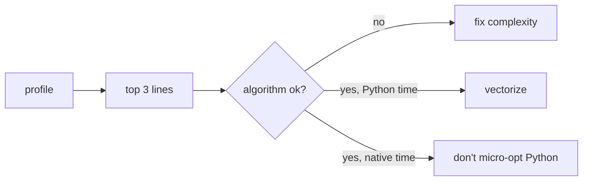
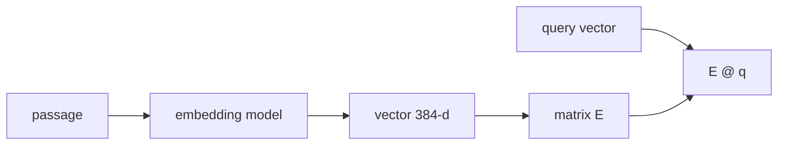

# Notes 08 — Профіль, NumPy, семантика

Поруч із лабою: [lab-08-performance-and-semantic-search.md](lab-08-performance-and-semantic-search.md).

Термінал, SVG flame graph, інколи IPython для `%timeit`. Оптимізація без профілю — здогад; на співбесіді це ловлять одразу.

Етапи здачі (**M1–M4**):

| | Що зробити | Як перевірити |
|---|---|---|
| **M1** | cProfile + py-spy **до** змін | топ-3 hotspot і гіпотеза в `docs/` |
| **M2** | BM25 у NumPy | той самий рейтинг (тест); таблиця speedup |
| **M3** | (бажано) embeddings + hybrid | precision@5 на парафразах |
| **M4** | README для чужинця | URL, GIF, усі таблиці Labs 1–8, відео |

**cProfile** — інструментує *кожен* виклик; вір рейтингу функцій, не абсолютним мілісекундам. **py-spy** — семпли стека, малий overhead, зручний flame graph. **Scalene** — ділить час рядка на Python vs native vs system. **Ufunc** — операція NumPy над *цілим* масивом у C (`arr * 2`, `np.log`). **Broadcasting** — розмірність 1 «розтягується», щоб форми зійшлись. **Embedding** — текст → вектор; схожий зміст поруч у просторі. **RRF** (Reciprocal Rank Fusion) — злити два ранжовані списки як `Σ 1/(k + rank)`, без нормалізації сирих score.

---

## Ідея

CPython на `a + b` робить купу роботи: тип, `__add__`, новий об’єкт, лічильник посилань. NumPy — суцільний буфер чисел і один C-цикл (часто SIMD).

Спочатку складність алгоритму. Потім «час у Python чи вже в C?». Лише тоді векторізація.



Keyword (BM25) точний на іменах і рідких словах, крихкий до синонімів. Semantic — навпаки. Hybrid = обидва + RRF.



---

## 1. Профіль до змін

```bash
python -m cProfile -s cumtime -m findex search index.bin "your query" | head
py-spy record -o docs/search.svg -- python -m findex search index.bin "your query"
```

**Очікуй:** топ `cumtime` часто не та функція, яку ти «знав». У SVG найширша смужка *твого* коду — кандидат. Якщо Scalene каже 90% native — пиляти Python-цикл безглуздо.

Гіпотезу запиши *до* патча. Після — ту саму команду. Інакше README стане «стало швидше на око».

---

## 2. NumPy vs генератор

```python
import timeit
import numpy as np

n = 10**6
py = timeit.timeit("sum(x*x for x in range(n))", globals={"n": n}, number=3)
np_t = timeit.timeit("(np.arange(n)**2).sum()", globals={"n": n, "np": np}, number=3)
print("1e6", py, np_t, py / np_t)

n = 10**2
py = timeit.timeit("sum(x*x for x in range(n))", globals={"n": n}, number=1000)
np_t = timeit.timeit("(np.arange(n)**2).sum()", globals={"n": n, "np": np}, number=1000)
print("1e2", py, np_t)
```

**Очікуй:** на мільйоні NumPy виграє в рази. На `10**2` може **програти**: наклад на виклик C більший за сам цикл. Тому маленькі списки постінгів у таблиці M2 майже без speedup — це нормально, поясни в README.

Постінги як `int32` масиви: один вираз BM25 на всі документи терміна, топ-k через `np.argpartition`, не повний sort. Рейтинг **ідентичний** Lab 3 — тест на фікстурі.

---

## 3. Broadcasting

```python
import numpy as np
a = np.arange(5)[:, None]
b = np.arange(3)[None, :]
print(a.shape, b.shape, (a * b).shape)
print(a * b)
```

**Очікуй:** `(5, 1)` і `(1, 3)` → `(5, 3)` без Python-циклу. Колонка × рядок = зовнішня таблиця.

`doc_len[doc_ids]` — fancy indexing: підтягнути довжини лише для документів цього терміна одним рядком.

---

## 4. Косинус на трьох реченнях

```python
from sentence_transformers import SentenceTransformer
import numpy as np

m = SentenceTransformer("all-MiniLM-L6-v2")
sents = [
    "the cat sat on the mat",
    "a feline rested on the rug",
    "the stock market fell",
]
e = m.encode(sents, normalize_embeddings=True)
sim = e @ e.T
print(np.round(sim, 3))
```

**Очікуй:** діагональ ≈ 1. Пара кіт/килим висока; ринок — низька до обох. Спільних слів у першій парі майже немає — саме це semantic search додає до BM25.

Чанки 200–500 токенів, не цілий 40-сторінковий документ в один вектор. Brute-force `E @ q` до сотень тисяч чанків зазвичай вистачає; HNSW/FAISS — коли заміряв, що вже тісно.

RRF: не мішай сирий BM25 зі сирим cosine — шкали різні. Ранги — так.

---

## У проєкті

Flame graph у `docs/`. `pytest-benchmark` на фікстурі, щоб регресія впала в CI. README з першого екрана: речення, живий URL, GIF, три цифри. Обмеження чесно. Тег `v1.0.0`.

---

## На співбесіді

- Чому «оптимізувати» без профілю — здогад. cProfile vs sampling.
- Чому цикл Python повільний і коли це не важливо (I/O, уже native).
- Ufunc і broadcasting одним прикладом.
- Навіщо chunking для embeddings.
- RRF vs мікс сирих score.
